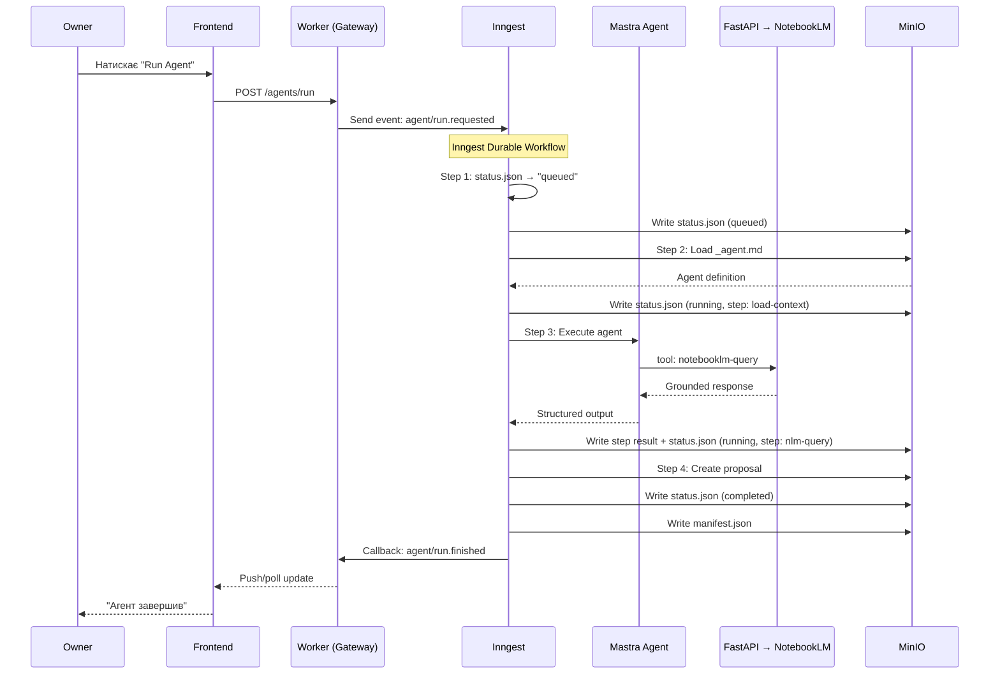
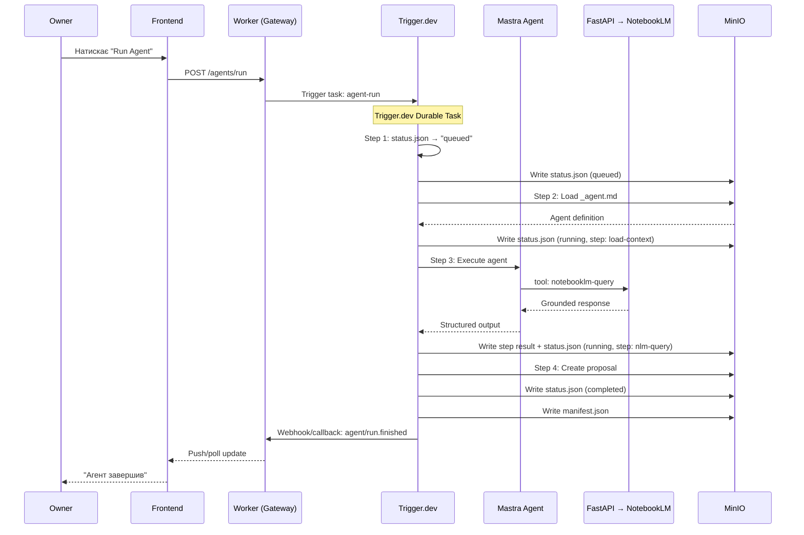
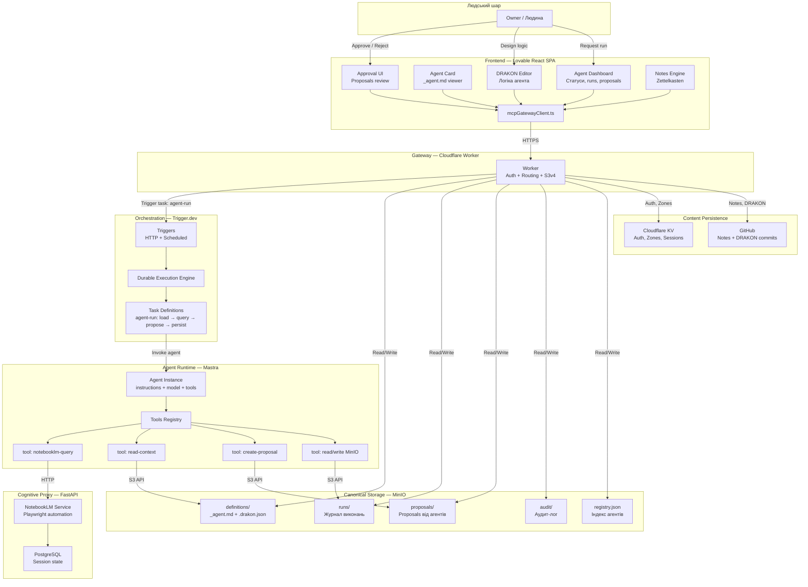

# Цільова оркестраційна модель: Trigger.dev V1

> Створено: 2026-02-15
> Автор: Головний архітектор системи
> Статус: Архітектурне рішення (DRY-RUN)
> Мова: Українська (канонічна)
> Базується на: ЦІЛЬОВА_АРХІТЕКТУРА_MASTRA_INNGEST.md, INBOX_AND_RUN_LIFECYCLE_V1.md, MIGRATION_INNGEST_TO_TRIGGERDEV_INVENTORY.md

---

## 0. Призначення

Цей документ описує **нову оркестраційну модель** з Trigger.dev як drop-in orchestrator замість Inngest, зберігаючи всі canonical інваріанти.

**[DECISION]** Trigger.dev замінює Inngest як orchestration layer. MinIO authority, Mastra runtime, proposal lifecycle, frontend projection — **без змін**.

---

## 1. Execution Chain: Before vs After

### 1.1 Baseline (поточна архітектура — Inngest)



### 1.2 Target (нова архітектура — Trigger.dev)



### 1.3 Ключові відмінності

| Аспект | Inngest | Trigger.dev | Вплив на архітектуру |
|--------|---------|-------------|---------------------|
| Entrypoint | `inngest.send(event)` | `tasks.trigger("agent-run", payload)` | **[DECISION]** Worker адаптує виклик |
| Step definition | `step.run("name", fn)` | `task step / subtask` | **[DECISION]** Wrapper адаптує |
| Serve endpoint | `POST /inngest` | Trigger.dev worker endpoint | **[DECISION]** Інший URL |
| Event format | `{ name, data }` | Task payload | **[DECISION]** Mapping у wrapper |
| Dashboard | Inngest Cloud dashboard | Trigger.dev dashboard | **[FACT]** Обидва мають dashboards |

**[FACT]** Для frontend і MinIO — sequence diagram **ідентичний**. Змінюється лише vendor box.

---

## 2. Run Lifecycle Mapping

### 2.1 State machine (без змін)

```
[ініційовано] → requested → queued → running → completed | failed
```

**[DECISION]** State machine залишається ідентичною. Зміна orchestrator не впливає на run states.

### 2.2 Хто встановлює стан

| Стан | Хто встановлює (Inngest) | Хто встановлює (Trigger.dev) | Де зберігається | Зміна |
|------|-------------------------|------------------------------|-----------------|-------|
| **requested** | Worker (перед відправкою event) | Worker (перед trigger task) | MinIO `status.json` | Без змін |
| **queued** | Inngest (event accepted) | Trigger.dev (task queued) | MinIO `status.json` | **[DECISION]** Trigger.dev wrapper пише status |
| **running** | Inngest step function | Trigger.dev task step | MinIO `status.json` | **[DECISION]** Trigger.dev wrapper пише status |
| **completed** | Inngest (last step done) | Trigger.dev (task completed) | MinIO `status.json` + `manifest.json` | **[DECISION]** Trigger.dev wrapper пише |
| **failed** | Inngest (error/timeout) | Trigger.dev (error/timeout) | MinIO `status.json` + `manifest.json` | **[DECISION]** Trigger.dev wrapper пише |

### 2.3 MinIO paths (без змін)

```
agents/<slug>/runs/<runId>/
  status.json          ← orchestrator wrapper пише
  manifest.json        ← orchestrator wrapper пише при завершенні
  steps/
    01-<step-name>.json  ← orchestrator wrapper пише після кожного кроку
    02-<step-name>.json
  output/
    proposal.json        ← agent tool пише через Inbox
```

**[FACT]** MinIO paths не змінюються. Frontend polling (`GET /runs/{runId}/status`) читає ті ж файли.

### 2.4 Поля status.json (без змін)

```json
{
  "run_id": "run_2026-02-14_080000_abc123",
  "agent_slug": "archivist-violin",
  "status": "running",
  "trigger": "manual",
  "started_at": "2026-02-14T08:00:00Z",
  "finished_at": null,
  "current_step": "nlm-query",
  "steps_total": 4,
  "steps_completed": 2,
  "proposals_created": [],
  "error": null
}
```

**[DECISION]** Schema status.json не змінюється. Orchestrator-specific metadata (якщо потрібен) додається в окреме поле `_orchestrator_meta`, яке frontend ігнорує.

---

## 3. Status Writer Invariant

### 3.1 Принцип

**[DECISION]** Status writer = orchestrator wrapper (раніше Inngest step function, тепер Trigger.dev task step).

```
Mastra виконує step → повертає результат orchestrator
→ Orchestrator (Trigger.dev) step записує step result у MinIO
→ Orchestrator оновлює status.json (статус, current_step, steps_completed)
→ UI polling читає status.json через Worker
```

**[FACT]** Mastra **НЕ** пише `status.json` напряму. Це незмінний інваріант.

### 3.2 Race condition prevention

| Сценарій | Гарантія | Як забезпечується |
|----------|----------|-------------------|
| Два steps пишуть status одночасно | Неможливо — steps послідовні | Trigger.dev durable execution (один step за раз) |
| Worker читає status під час запису | Eventual consistency OK | MinIO S3 read-after-write consistency |
| Два runs одного агента | Concurrency = 1 per agent | Trigger.dev concurrency limit на task |
| Orchestrator crash mid-step | Retry з останнього checkpoint | Trigger.dev durable execution replay |

### 3.3 Step logs та status.json зв'язок

**[DECISION]** Orchestrator wrapper виконує **атомарну** послідовність після кожного step:

```
1. Записати step result → agents/<slug>/runs/<runId>/steps/<N>-<name>.json
2. Оновити status.json → { current_step: next, steps_completed: N }
```

Якщо запис step result вдався, але status.json update впав:
- **Retry** status.json update (idempotent write)
- Step result вже записаний — не дублюється

**[DECISION]** Порядок записів: step result ПЕРЕД status update. Це гарантує, що status.json ніколи не показує step як completed до того, як step result записаний.

---

## 4. Retries / Backoff / Timeouts

### 4.1 Концептуальна модель

| Параметр | Значення | Обґрунтування |
|----------|----------|---------------|
| **Max retries per step** | 3 | NotebookLM може бути тимчасово недоступний |
| **Backoff strategy** | Exponential: 10s, 30s, 90s | Уникнення перенавантаження NLM |
| **Step timeout** | 120 секунд | NLM browser automation може зависнути |
| **Total run timeout** | 600 секунд (10 хв) | Захист від нескінченних runs |
| **Concurrency per agent** | 1 | Один run одного агента одночасно |
| **Global concurrency** | 5 | Максимум 5 одночасних agent runs у системі |

### 4.2 Trigger.dev mapping (концептуально)

```
Trigger.dev Task definition (псевдо):
  task "agent-run":
    concurrency:
      limit: 1
      key: agent_slug
    retry:
      maxAttempts: 3
      factor: 3
      minTimeout: 10s
    timeout: 600s

    steps:
      step "load-context" (timeout: 30s)
      step "execute-agent" (timeout: 120s)
      step "create-proposal" (timeout: 30s)
      step "persist-results" (timeout: 30s)
```

### 4.3 MinIO run metadata для retries

**[DECISION]** Retry metadata записується в `manifest.json`:

```json
{
  "retries": {
    "step_2_nlm-query": {
      "attempts": 2,
      "last_error": "NLM_UNAVAILABLE: 503",
      "recovered": true
    }
  }
}
```

Frontend може показувати retry info у Run Timeline (опціонально).

---

## 5. Cron / Schedules

### 5.1 Поточні cron-патерни (з `_agent.md`)

| Агент | Cron | Опис |
|-------|------|------|
| `archivist-violin` | `0 8 * * 1-5` | Щоденний аналіз (пн-пт, 8:00) |
| (Generic) DailyOps | `0 9 * * *` | Щоденні операції |
| (Generic) Digest | `0 18 * * 5` | Щотижневий digest (п'ятниця, 18:00) |
| (Generic) Archive | `0 2 * * 0` | Щотижнева архівація (неділя, 2:00) |

### 5.2 Trigger.dev cron mapping

**[DECISION]** Cron schedules визначаються у `_agent.md` (поле `triggers.cron`) і реєструються як Trigger.dev scheduled tasks при startup Agent Service.

```
_agent.md → Agent Service startup → register Trigger.dev scheduled task
```

**[DECISION]** Зміна cron у `_agent.md` → перереєстрація scheduled task при наступному Agent Service restart або через explicit re-sync endpoint.

### 5.3 Як уникнути повернення gh-aw патернів

**[DECISION]** Cron tasks у Trigger.dev:
- **НЕ** створюють окремих workflow/pipeline визначень (це gh-aw патерн)
- Використовують **той самий** `agent-run` task з `trigger: "cron"` у metadata
- Agent Service реєструє cron schedule з `_agent.md` — це єдине джерело розкладу
- Якщо `triggers.cron` видалено з `_agent.md` → scheduled task видаляється

```
Правильно:
  _agent.md { triggers: { cron: "0 8 * * 1-5" } }
  → Agent Service → Trigger.dev scheduled task → agent-run(trigger: "cron")

Неправильно (gh-aw патерн):
  Окремий DailyOps.yaml workflow
  Окремий GitHub Actions cron
  Hardcoded cron у runtime коді
```

---

## 6. Deployment Topology (Target)

### 6.1 Agent Service з Trigger.dev

```
┌─────────────────────────────────────────────────┐
│          Agent Service (Node.js/TypeScript)       │
│                                                   │
│   ┌──────────────┐    ┌──────────────────────┐   │
│   │  Trigger.dev  │    │   Mastra              │   │
│   │  SDK Client   │    │   Agent Runtime       │   │
│   │              │    │                        │   │
│   │  Tasks:       │    │   Agents:              │   │
│   │  - agent-run  │◄──►│   - dynamic from       │   │
│   │  - agent-cron │    │     _agent.md          │   │
│   │              │    │                        │   │
│   │  Triggers:    │    │   Tools:               │   │
│   │  - HTTP       │    │   - notebooklm-query   │   │
│   │  - Scheduled  │    │   - read-context        │   │
│   └──────────────┘    │   - create-proposal     │   │
│                        └──────────────────────┘   │
│                                                   │
│   HTTP endpoint: Trigger.dev worker endpoint      │
└─────────────────────────────────────────────────┘
         │                          │
         ▼                          ▼
   Trigger.dev Cloud          MinIO + FastAPI
   (або self-hosted)
```

### 6.2 Варіанти deployment

| Варіант | Опис | Ціна |
|---------|------|------|
| **Trigger.dev Cloud** | Managed, zero infra | Paid tier при масштабуванні |
| **Trigger.dev self-hosted** | Docker, повний контроль | $0/міс (self-hosted) |

**[DECISION]** Рекомендований шлях: self-hosted для dev/staging, cloud для production (опціонально).

**[FACT]** Trigger.dev v3 є open-source і підтримує self-hosting через Docker.

---

## 7. Архітектурна діаграма (Target)



---

*Цей документ описує цільову оркестраційну модель з Trigger.dev. Він є drop-in заміною для orchestration-специфічних секцій ЦІЛЬОВА_АРХІТЕКТУРА_MASTRA_INNGEST.md.*
