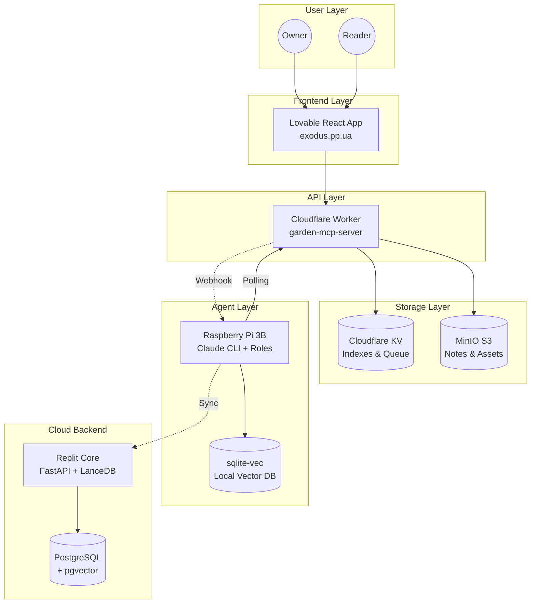
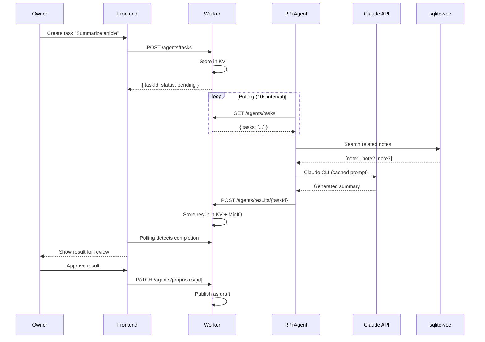
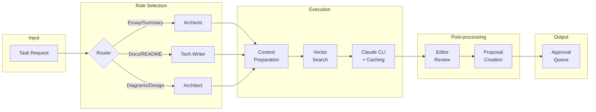

# 🌱 AI Agent System для Digital Garden — Архітектурна документація

**Версія**: 1.0  
**Дата**: 2026-01-16  
**Статус**: Technical Specification (Ready for Review)  
**Проєкт**: exodus.pp.ua Digital Garden

---

## 📋 Зміст

1. [Огляд системи](#1-огляд-системи)
2. [Архітектурні принципи](#2-архітектурні-принципи)
3. [Компоненти системи](#3-компоненти-системи)
4. [Межі відповідальності](#4-межі-відповідальності)
5. [Потоки даних](#5-потоки-даних)
6. [Діаграми](#6-діаграми)

---

## 1. Огляд системи

### 1.1 Мета

Створити **еволюційну систему AI-агентів**, де:
- AI-агент є **повноцінним учасником екосистеми знань** (не просто API)
- Агент **пропонує задачі** власнику, але **не виконує без схвалення**
- Зміни вносяться через **PR/пропозиції**, а не прямі модифікації
- Система **оптимізована для обмежених ресурсів** (RPi 3B, 1GB RAM)

### 1.2 Hybrid Architecture

```
┌─────────────────────────────────────────────────────────────────────────┐
│                          FRONTEND LAYER                                  │
│   Lovable React App (exodus.pp.ua)                                      │
│   - Відображення контенту та коментарів                                 │
│   - UI для схвалення пропозицій агента                                  │
│   - Owner Dashboard для управління агентами                             │
└────────────────────────────────┬────────────────────────────────────────┘
                                 │ HTTPS
                                 ▼
┌─────────────────────────────────────────────────────────────────────────┐
│                          API GATEWAY LAYER                               │
│   Cloudflare Worker (garden-mcp-server)                                  │
│   - Маршрутизація запитів                                               │
│   - Авторизація (JWT)                                                   │
│   - Черга задач для агентів                                             │
│   - Зберігання результатів                                              │
└────────────────────────────────┬────────────────────────────────────────┘
                                 │
                    ┌────────────┴────────────┐
                    ▼                         ▼
┌───────────────────────────┐    ┌───────────────────────────────────────┐
│   STORAGE LAYER           │    │   AGENT RUNTIME LAYER                  │
│                           │    │                                        │
│   MinIO S3                │    │   ┌────────────────────────────────┐   │
│   - Notes (canonical)     │    │   │   Raspberry Pi 3B (Local)      │   │
│   - Agent outputs         │    │   │   - Claude CLI Pro             │   │
│   - Attachments           │    │   │   - Prompt caching             │   │
│                           │    │   │   - Role-based execution       │   │
│   Cloudflare KV           │    │   │   - sqlite-vec (vector search) │   │
│   - Indexes               │    │   └───────────────┬────────────────┘   │
│   - Task queue            │    │                   │                    │
│   - Agent state           │    │                   ▼                    │
│   - Comments              │    │   ┌────────────────────────────────┐   │
│                           │    │   │   Replit Core (Cloud)          │   │
│                           │    │   │   - LanceDB (vector backup)    │   │
│                           │    │   │   - PostgreSQL + pgvector      │   │
│                           │    │   │   - Background workers         │   │
│                           │    │   │   - Batch processing           │   │
│                           │    │   └────────────────────────────────┘   │
└───────────────────────────┘    └───────────────────────────────────────┘
```

### 1.3 Ключові характеристики

| Параметр | Значення |
|----------|----------|
| **Hardware (Edge)** | Raspberry Pi 3B, 1GB RAM, ARM Cortex-A53 |
| **Cloud Backend** | Replit Core (PostgreSQL, Always-On) |
| **API Gateway** | Cloudflare Workers |
| **Storage** | MinIO S3 + Cloudflare KV |
| **LLM Provider** | Anthropic Claude 3.5 Sonnet (via CLI Pro) |
| **Vector DB (Edge)** | sqlite-vec (~50MB RAM для 10K docs) |
| **Vector DB (Cloud)** | LanceDB / pgvector |
| **Embedding Model** | all-MiniLM-L6-v2 (22.7MB, 384 dims) |

---

## 2. Архітектурні принципи

### 2.1 Агент як Колега (Agent-as-Colleague)

```
┌────────────────────────────────────────────────────────────┐
│                    РІВЕНЬ АВТОНОМНОСТІ                     │
├────────────────────────────────────────────────────────────┤
│  ❌ Повністю автономний (самостійно змінює систему)        │
│  ❌ Реактивний (тільки по запиту користувача)              │
│  ✅ ПРОПОЗИЦІЙНИЙ: Аналізує → Пропонує → Чекає схвалення   │
└────────────────────────────────────────────────────────────┘
```

**Практичний приклад**:
```
1. Архіваріус виявляє 5 нотаток на тему "Cloudflare Workers"
2. Генерує пропозицію: "Створити синтетичне есе з цих 5 джерел"
3. Відправляє пропозицію в чергу на схвалення
4. Owner переглядає через UI → Approve / Reject / Edit
5. Після Approve → агент виконує задачу
6. Результат з'являється як draft (не публікується автоматично)
```

### 2.2 Право на зміну коду

```
┌──────────────────────────────────────────────────────────────┐
│                    МОДЕЛЬ ЗМІН                               │
├──────────────────────────────────────────────────────────────┤
│  Агент НЕ має прямого доступу до:                            │
│  - Git репозиторію                                           │
│  - Файлової системи production                               │
│  - Бази даних (write)                                        │
│                                                              │
│  Агент МОЖЕ:                                                 │
│  - Генерувати контент (markdown, docs)                       │
│  - Створювати пропозиції змін (proposals)                    │
│  - Аналізувати код та давати рекомендації                    │
│  - Готувати PR-описи (не виконувати)                         │
└──────────────────────────────────────────────────────────────┘
```

### 2.3 Edge-First Design

```
                    ┌──────────────────────┐
                    │  Інтернет недоступний │
                    │  (Degraded Mode)      │
                    └──────────┬───────────┘
                               ▼
┌─────────────────────────────────────────────────────────────────┐
│   RASPBERRY PI (EDGE)                                            │
│   ┌─────────────────────────────────────────────────────────┐   │
│   │  ✅ Локальний vector search (sqlite-vec)                 │   │
│   │  ✅ Кешовані system prompts                              │   │
│   │  ✅ Офлайн аналіз нотаток                                │   │
│   │  ⚠️  Claude API недоступний → черга задач для пізніше   │   │
│   │  ❌ Синхронізація з Replit заблокована                   │   │
│   └─────────────────────────────────────────────────────────┘   │
│                                                                  │
│   При відновленні зв'язку:                                       │
│   1. Синхронізація черги задач                                   │
│   2. Відправка накопичених результатів                           │
│   3. Оновлення vector index з Replit                             │
└─────────────────────────────────────────────────────────────────┘
```

---

## 3. Компоненти системи

### 3.1 Lovable Frontend

**Розташування**: `src/` (React + Vite + TypeScript)

**Нові компоненти для системи агентів**:

| Компонент | Призначення |
|-----------|-------------|
| `AgentDashboard` | Панель управління агентами |
| `AgentProposalList` | Список пропозицій на схвалення |
| `AgentOutputViewer` | Перегляд результатів агента |
| `AgentRoleSelector` | Вибір ролі для нової задачі |
| `AgentTaskHistory` | Історія виконаних задач |

**Нові hooks**:

| Hook | Призначення |
|------|-------------|
| `useAgentProposals` | Отримання/схвалення пропозицій |
| `useAgentTasks` | CRUD для задач агентів |
| `useAgentStatus` | Статус виконання (polling) |

### 3.2 Cloudflare Worker

**Розташування**: `infrastructure/cloudflare/worker/index.js`

**Нові endpoints для агентів**:

```
POST /agents/tasks              → Створити задачу (owner-only)
GET  /agents/tasks              → Список задач (polling)
GET  /agents/tasks/:taskId      → Статус конкретної задачі
PATCH /agents/tasks/:taskId     → Оновити статус задачі
POST /agents/results/:taskId    → Відправити результат (від RPi)
GET  /agents/proposals          → Список пропозицій
PATCH /agents/proposals/:id     → Approve/Reject пропозицію
GET  /agents/history            → Історія виконаних задач
```

### 3.3 Raspberry Pi Agent Runtime

**Розташування**: Нова директорія `agents/` на RPi

```
~/garden-agents/
├── orchestrator.py          # Головний daemon
├── roles/
│   ├── __init__.py
│   ├── archivist.py         # Архіваріус
│   ├── technical_writer.py  # Технічний письменник
│   ├── architect.py         # Архітектор
│   └── base_role.py         # Базовий клас ролі
├── prompts/
│   ├── archivist.md         # System prompt
│   ├── technical_writer.md
│   └── architect.md
├── storage/
│   ├── vector_db.py         # sqlite-vec wrapper
│   ├── cache.py             # Prompt cache manager
│   └── sync.py              # Синхронізація з Replit
├── api/
│   ├── worker_client.py     # HTTP client для Worker
│   └── claude_wrapper.py    # Claude CLI wrapper з caching
├── state/
│   ├── garden.db            # sqlite-vec database
│   ├── queue.json           # Локальна черга задач
│   └── cache/               # Prompt cache files
└── config.py                # Конфігурація
```

### 3.4 Replit Core Service

**Розташування**: Окремий репозиторій на Replit

```
garden-agent-backend/
├── main.py                  # FastAPI server
├── database/
│   ├── models.py            # SQLAlchemy models
│   └── lancedb_client.py    # LanceDB wrapper
├── workers/
│   ├── batch_embeddings.py  # Batch re-embedding
│   └── integrity_check.py   # Data integrity validation
├── api/
│   ├── sync.py              # Sync endpoints для RPi
│   └── search.py            # Advanced vector search
└── requirements.txt
```

---

## 4. Межі відповідальності

### 4.1 Матриця відповідальності

| Компонент | Read Notes | Write Notes | Semantic Search | Task Queue | LLM Calls | Vector DB |
|-----------|------------|-------------|-----------------|------------|-----------|-----------|
| **Lovable Frontend** | ✅ via API | ❌ | ❌ | ✅ Read | ❌ | ❌ |
| **Cloudflare Worker** | ✅ | ✅ (owner) | ❌ | ✅ R/W | ❌ | ❌ |
| **RPi Agent** | ✅ local | ✅ drafts | ✅ local | ✅ polling | ✅ | ✅ sqlite-vec |
| **Replit Backend** | ✅ sync | ✅ backup | ✅ advanced | ❌ | ❌ | ✅ LanceDB |

### 4.2 Розподіл по компонентах

```
┌─────────────────────────────────────────────────────────────────────────┐
│                              LOVABLE FRONTEND                           │
│   Відповідальність:                                                     │
│   ✓ Відображення UI для власника                                        │
│   ✓ Перегляд пропозицій агентів                                         │
│   ✓ Approve/Reject workflow                                             │
│   ✓ Ініціація задач для агентів                                         │
│   ✗ НЕ виконує LLM запити                                               │
│   ✗ НЕ зберігає дані локально                                           │
└─────────────────────────────────────────────────────────────────────────┘
                                     │
                                     ▼
┌─────────────────────────────────────────────────────────────────────────┐
│                          CLOUDFLARE WORKER                              │
│   Відповідальність:                                                     │
│   ✓ API Gateway для всіх запитів                                        │
│   ✓ Авторизація та автентифікація                                       │
│   ✓ Task Queue (KV-based)                                               │
│   ✓ Зберігання результатів агентів                                      │
│   ✓ Webhook до RPi при нових задачах                                    │
│   ✗ НЕ виконує LLM запити                                               │
│   ✗ НЕ виконує vector search                                            │
└─────────────────────────────────────────────────────────────────────────┘
                                     │
            ┌────────────────────────┴────────────────────────┐
            ▼                                                 ▼
┌───────────────────────────────────┐    ┌───────────────────────────────────┐
│        RASPBERRY PI AGENT         │    │        REPLIT BACKEND             │
│   Відповідальність:               │    │   Відповідальність:               │
│   ✓ Claude CLI invocation         │    │   ✓ Persistent storage (backup)   │
│   ✓ Prompt caching                │    │   ✓ Advanced vector search        │
│   ✓ Role-based execution          │    │   ✓ Batch processing              │
│   ✓ Local vector search           │    │   ✓ Data integrity checks         │
│   ✓ Генерація контенту            │    │   ✓ Sync endpoint для RPi         │
│   ✓ Пропозиції задач              │    │   ✗ НЕ виконує LLM запити         │
│   ✗ НЕ публікує автоматично       │    │   ✗ НЕ має прямого доступу до     │
│   ✗ НЕ змінює production          │    │     Cloudflare Worker             │
└───────────────────────────────────┘    └───────────────────────────────────┘
```

---

## 5. Потоки даних

### 5.1 Flow: Створення задачі для агента

```
Owner (Lovable UI)
    │
    │  1. "Створити резюме для статті X"
    ▼
Lovable Frontend
    │
    │  2. POST /agents/tasks { role: "archivist", action: "summarize", input: {...} }
    ▼
Cloudflare Worker
    │
    │  3. Валідація owner auth
    │  4. Створення task у KV: agent:task:{taskId}
    │  5. Webhook до RPi (опціонально)
    │
    ├──►  Response: { taskId, status: "pending" }
    │
    │  6. RPi polling: GET /agents/tasks
    ▼
RPi Agent Daemon
    │
    │  7. Завантаження context (vector search)
    │  8. Claude CLI invocation з prompt caching
    │  9. Генерація результату
    │
    │  10. POST /agents/results/{taskId} { content, metadata }
    ▼
Cloudflare Worker
    │
    │  11. Збереження результату в KV + MinIO
    │  12. Оновлення статусу: "completed"
    ▼
Lovable Frontend
    │
    │  13. Polling виявляє новий результат
    │  14. Відображення для Owner review
    ▼
Owner
    │
    │  15. Approve → публікація як draft
    │  або Reject → відхилення
    ▼
[END]
```

### 5.2 Flow: Агент пропонує задачу (Proactive Mode)

```
RPi Agent Daemon (Background)
    │
    │  1. Періодичний аналіз Digital Garden
    │     - Vector search: "orphan notes" (без зв'язків)
    │     - Кластерний аналіз: групи схожих нотаток
    │     - Temporal analysis: давно не оновлені
    │
    │  2. Виявлено: 5 нотаток про "Cloudflare" без synthesis
    │
    │  3. POST /agents/proposals {
    │       type: "essay_suggestion",
    │       role: "archivist",
    │       title: "Синтез нотаток про Cloudflare Workers",
    │       description: "Виявлено 5 пов'язаних нотаток...",
    │       sourceNotes: ["note-1", "note-2", ...],
    │       estimatedEffort: "~2000 tokens"
    │     }
    ▼
Cloudflare Worker
    │
    │  4. Збереження proposal у KV
    │  5. Notification для Owner (email/webhook опціонально)
    ▼
Lovable Frontend
    │
    │  6. AgentProposalList показує нову пропозицію
    │  7. Owner бачить badge "1 нова пропозиція"
    ▼
Owner
    │
    │  8. Review proposal details
    │  9. Approve / Reject / Edit & Approve
    │
    └──► [Якщо Approve] → Створюється task → Flow 5.1
```

### 5.3 Flow: Синхронізація RPi ↔ Replit

```
┌─────────────────┐                    ┌─────────────────┐
│   RPi (Edge)    │                    │  Replit (Cloud) │
│   sqlite-vec    │                    │  LanceDB        │
└────────┬────────┘                    └────────┬────────┘
         │                                      │
         │  1. Нова нотатка додана локально     │
         │     (через Obsidian sync)            │
         │                                      │
         │  2. Generate embedding (MiniLM)      │
         │     Store in sqlite-vec              │
         │                                      │
         │  3. POST /sync/notes                 │
         │     { slug, embedding, metadata }    │
         │─────────────────────────────────────►│
         │                                      │
         │                                      │  4. Store in LanceDB
         │                                      │     Update PostgreSQL
         │                                      │
         │◄─────────────────────────────────────│
         │  5. 200 OK { synced: true }          │
         │                                      │
         │                                      │
         │  === REVERSE SYNC (Cloud → Edge) === │
         │                                      │
         │  6. GET /sync/updates?since=timestamp│
         │─────────────────────────────────────►│
         │                                      │
         │                                      │  7. Query changes
         │                                      │
         │◄─────────────────────────────────────│
         │  8. { updates: [...], cursor }       │
         │                                      │
         │  9. Apply updates to sqlite-vec      │
         │                                      │
```

---

## 6. Діаграми

### 6.1 Загальна архітектура системи (C4 Container)



### 6.2 Агентна взаємодія



### 6.3 Пайплайн обробки задач



---

## Наступні документи

- [01-technical-requirements.md](./01-technical-requirements.md) — Технічне завдання (ТЗ/SRS)
- [02-agent-roles.md](./02-agent-roles.md) — Проєктування ролей AI-агента
- [03-orchestration.md](./03-orchestration.md) — Оркестрація та workflow
- [04-replit-implementation.md](./04-replit-implementation.md) — План реалізації на Replit Core
- [05-rpi-integration.md](./05-rpi-integration.md) — Інтеграція з Claude CLI (RPi)
- [06-roadmap.md](./06-roadmap.md) — Дорожня карта розробки
