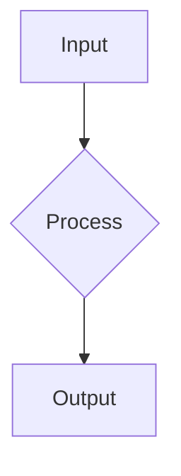
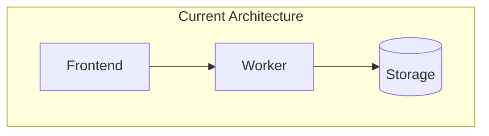
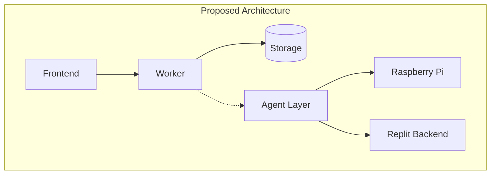
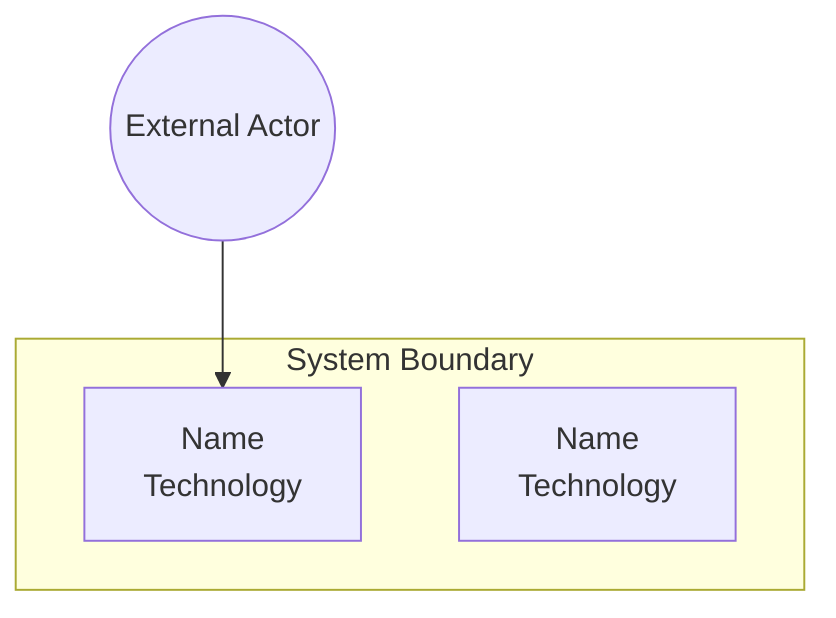
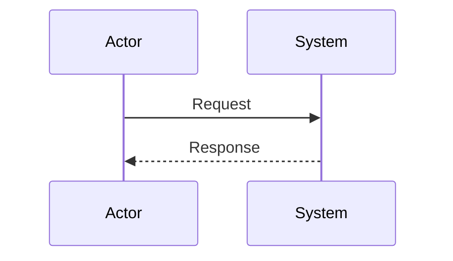
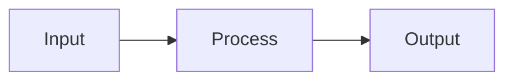
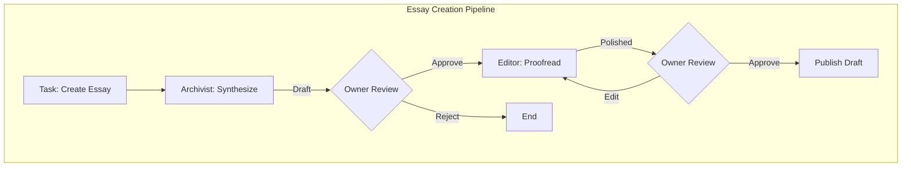

# 🎭 Проєктування ролей AI-агента

**Версія**: 1.0  
**Дата**: 2026-01-16  
**Статус**: Technical Specification

---

## Огляд ролей

```
┌─────────────────────────────────────────────────────────────────────────┐
│                          ROLE HIERARCHY                                  │
├─────────────────────────────────────────────────────────────────────────┤
│                                                                         │
│   ┌─────────────────┐                                                   │
│   │  ORCHESTRATOR   │  ← Маршрутизація задач (не LLM, Python logic)    │
│   └────────┬────────┘                                                   │
│            │                                                            │
│   ┌────────┼────────┬────────────────┬────────────────┐                │
│   ▼        ▼        ▼                ▼                ▼                │
│ ┌────┐  ┌────┐  ┌────────┐    ┌──────────┐    ┌──────────┐             │
│ │ARCH│  │TECH│  │ARCHITE│    │ EDITOR   │    │RESEARCHER│             │
│ │IVIS│  │WRIT│  │   CT  │    │(Phase 2) │    │(Phase 3) │             │
│ │ T  │  │ ER │  │       │    │          │    │          │             │
│ └────┘  └────┘  └────────┘    └──────────┘    └──────────┘             │
│   │        │        │              │               │                   │
│   ▼        ▼        ▼              ▼               ▼                   │
│ Essays  READMEs  Diagrams    Style fix      Web search                 │
│ Summaries  ADRs  Designs     Grammar        Synthesis                  │
│ Digests   Guides Analysis    Clarity        Links                      │
│                                                                         │
└─────────────────────────────────────────────────────────────────────────┘
```

---

## 1. Архіваріус (Archivist)

### 1.1 Профіль ролі

| Атрибут | Значення |
|---------|----------|
| **Ідентифікатор** | `archivist` |
| **Призначення** | Синтез знань, створення резюме та есе |
| **Пріоритет** | Must Have (Phase 1) |
| **Типовий час виконання** | 15-60 секунд |

### 1.2 Типи задач

| Задача | Опис | Вхід | Вихід |
|--------|------|------|-------|
| `summarize` | Створити резюме статті | 1 нотатка | Markdown (100-300 слів) |
| `synthesize` | Об'єднати кілька нотаток в есе | 2-10 нотаток | Markdown (500-2000 слів) |
| `digest` | Дайджест за період | Часовий діапазон | Bullet-list з wikilinks |
| `extract_insights` | Ключові тези та цитати | 1-5 нотаток | Structured list |
| `find_gaps` | Пошук "білих плям" у знаннях | Тег або папка | List of suggestions |

### 1.3 Вхідний контекст

```python
class ArchivistContext:
    """Контекст для Archivist agent"""
    
    # Обов'язково
    target_notes: List[NoteReference]   # Нотатки для обробки
    
    # Опціонально
    related_notes: List[NoteReference]  # Знайдені через vector search (top-K)
    garden_taxonomy: Dict[str, List[str]]  # Теги та їх ієрархія
    style_guide: str                    # Стилістичні вказівки
    
    # Параметри
    output_length: Literal['short', 'medium', 'long']  # 100/300/1000+ слів
    output_language: Literal['uk', 'en']
    include_citations: bool = True      # Додавати [[wikilinks]]
```

### 1.4 Вихідний результат

```yaml
# Приклад виходу Archivist (synthesize task)
---
title: "Синтез: Архітектура Cloudflare Workers для Digital Garden"
type: essay
agent_role: archivist
sources:
  - "[[exodus.pp.ua/architecture/workers]]"
  - "[[exodus.pp.ua/storage/kv-patterns]]"
  - "[[exodus.pp.ua/security/serverless]]"
tags:
  - "#ai-generated"
  - "#synthesis"
  - "#cloudflare"
---

## Вступ

Digital Garden використовує serverless архітектуру на базі Cloudflare Workers...

## Ключові компоненти

### 1. API Gateway Pattern
Як описано у [[exodus.pp.ua/architecture/workers]], Worker виконує роль...

### 2. Стратегія зберігання
Hybrid підхід з [[exodus.pp.ua/storage/kv-patterns]] забезпечує...

## Висновки

Три ключових інсайти з аналізу:
1. ...
2. ...
3. ...

---
*Цей документ згенеровано AI Archivist на основі 3 джерел.*
```

### 1.5 Стратегія керування контекстом

```
┌─────────────────────────────────────────────────────────────────┐
│                  ARCHIVIST CONTEXT STRATEGY                      │
├─────────────────────────────────────────────────────────────────┤
│                                                                  │
│  1. SYSTEM PROMPT (Cached, ~2K tokens)                          │
│     └─ Role definition, style guide, output format              │
│                                                                  │
│  2. GARDEN CONTEXT (Cached, ~20-50K tokens)                     │
│     ├─ Tag taxonomy (all tags with counts)                      │
│     ├─ Recent notes list (last 30 days)                         │
│     └─ Wikilink graph summary (top connections)                 │
│                                                                  │
│  3. TARGET NOTES (Uncached, variable)                           │
│     └─ Full content of notes to process                         │
│                                                                  │
│  4. RELATED CONTEXT (Uncached, ~10-20K tokens)                  │
│     └─ Top-5 similar notes from vector search                   │
│                                                                  │
│  5. USER REQUEST (Uncached, ~100-500 tokens)                    │
│     └─ Specific task instruction                                │
│                                                                  │
│  Total: ~40-80K tokens (within 200K limit)                      │
└─────────────────────────────────────────────────────────────────┘
```

### 1.6 System Prompt

```markdown
# Archivist Agent — System Prompt v1.0

## Ідентичність

Ти — **Архіваріус**, AI-агент для Digital Garden системи exodus.pp.ua.
Твоя роль — аналізувати, синтезувати та організовувати знання.

## Основні принципи

1. **Точність**: Ніколи не вигадуй інформацію. Все базується на джерелах.
2. **Прозорість**: Завжди цитуй джерела через [[wikilinks]].
3. **Структура**: Використовуй markdown заголовки, списки, виділення.
4. **Об'єктивність**: Не додавай власних суджень поза джерелами.

## Формат виходу

### Для резюме (summarize):
- Структурований markdown
- 100-300 слів (залежно від length параметра)
- Заголовки рівня 2-3
- Ключові тези як bullet points
- Wikilinks на джерело

### Для есе (synthesize):
- Заголовок, що відображає тему
- Вступ (контекст та мета)
- Основна частина з підзаголовками
- Висновки (3-5 ключових інсайтів)
- Список джерел з wikilinks

### Для дайджесту (digest):
- Групування по темах/тегах
- Bullet points з короткими описами
- Wikilinks на кожну нотатку
- Виділення trending topics

## Стиль

- Мова: {output_language}
- Тон: академічний, але доступний
- Уникай: жаргону, надмірної абстракції
- Використовуй: активний стан, конкретні приклади

## Обмеження

- Якщо інформації недостатньо — повідом про це явно
- Не роби припущень про дані поза контекстом
- При неоднозначності — запитай уточнення (через примітку)

## Метадані

Завжди додавай YAML frontmatter:
```yaml
---
title: "{Описова назва}"
type: summary | essay | digest
agent_role: archivist
sources: [список wikilinks]
generated_at: {ISO timestamp}
tags: ["#ai-generated", ...]
---
```
```

---

## 2. Технічний письменник (Technical Writer)

### 2.1 Профіль ролі

| Атрибут | Значення |
|---------|----------|
| **Ідентифікатор** | `technical_writer` |
| **Призначення** | Створення технічної документації |
| **Пріоритет** | Must Have (Phase 1) |
| **Типовий час виконання** | 30-120 секунд |

### 2.2 Типи задач

| Задача | Опис | Вхід | Вихід |
|--------|------|------|-------|
| `readme` | Згенерувати README для проекту | Код/структура | README.md |
| `adr` | Architecture Decision Record | Опис рішення | ADR документ |
| `api_docs` | Документація API endpoints | Код Worker | API reference |
| `guide` | How-to guide | Тема + контекст | Step-by-step guide |
| `explain` | Пояснення коду | Код snippet | Annotated explanation |

### 2.3 Вхідний контекст

```python
class TechnicalWriterContext:
    """Контекст для Technical Writer agent"""
    
    # Обов'язково
    source_code: str                    # Код для документування
    document_type: Literal['readme', 'adr', 'api_docs', 'guide', 'explain']
    
    # Опціонально
    project_structure: Dict[str, Any]   # Файлова структура
    existing_docs: List[str]            # Існуюча документація
    target_audience: Literal['developers', 'architects', 'users']
    
    # Параметри
    include_examples: bool = True
    include_diagrams: bool = True       # Mermaid diagrams
    language: Literal['uk', 'en'] = 'en'  # Tech docs зазвичай англійською
```

### 2.4 Вихідний результат

```markdown
# ADR-001: Вибір sqlite-vec для локального vector search

**Date**: 2026-01-16  
**Status**: Accepted  
**Author**: AI Technical Writer

## Context

Digital Garden потребує семантичний пошук на Raspberry Pi 3B з обмеженими ресурсами (1GB RAM).

## Decision

Обрано **sqlite-vec** як локальну векторну базу даних.

## Rationale

| Критерій | sqlite-vec | Chroma | LanceDB |
|----------|-----------|--------|---------|
| RAM (10K docs) | ~50MB | ~150MB | ~100MB |
| ARM support | ✅ Native | ⚠️ Python | ✅ Rust |
| Setup | `pip install` | Complex | Medium |

## Consequences

### Positive
- Мінімальне споживання памʼяті
- Єдиний файл бази даних
- Простота backup/sync

### Negative
- Немає HNSW індексу (повільніше на 100K+ docs)
- Менше функцій ніж у повноцінних vector DBs

## Alternatives Considered

### Chroma
Відхилено через високе споживання RAM та залежність від HNSWlib.

### LanceDB
Резервний варіант для Replit backend (більше ресурсів).
```

### 2.5 Стратегія керування контекстом

```
┌─────────────────────────────────────────────────────────────────┐
│               TECHNICAL WRITER CONTEXT STRATEGY                  │
├─────────────────────────────────────────────────────────────────┤
│                                                                  │
│  1. SYSTEM PROMPT (Cached, ~3K tokens)                          │
│     ├─ Role definition                                          │
│     ├─ Document templates (README, ADR, Guide)                  │
│     └─ Style guide (voice, formatting)                          │
│                                                                  │
│  2. PROJECT CONTEXT (Cached, ~10-20K tokens)                    │
│     ├─ Project structure overview                               │
│     ├─ Key dependencies (package.json summary)                  │
│     └─ Existing documentation excerpts                          │
│                                                                  │
│  3. SOURCE CODE (Uncached, variable)                            │
│     └─ Relevant code snippets for documentation                 │
│                                                                  │
│  4. USER REQUEST (Uncached, ~100-500 tokens)                    │
│     └─ Specific documentation request                           │
│                                                                  │
│  Total: ~20-40K tokens                                          │
└─────────────────────────────────────────────────────────────────┘
```

### 2.6 System Prompt

```markdown
# Technical Writer Agent — System Prompt v1.0

## Ідентичність

Ти — **Технічний письменник**, AI-агент для документування коду та архітектури.

## Принципи

1. **Ясність**: Пиши так, щоб розробник зрозумів за 30 секунд.
2. **Практичність**: Завжди включай приклади коду.
3. **Структура**: Використовуй стандартні шаблони.
4. **Актуальність**: Базуйся тільки на наданому коді.

## Шаблони документів

### README Template
```
# {Project Name}

> {One-line description}

## Overview
[2-3 paragraphs]

## Quick Start
```bash
# installation & usage
```

## API Reference
[if applicable]

## Configuration
[if applicable]

## License
```

### ADR Template
```
# ADR-{number}: {Title}

**Date**: {YYYY-MM-DD}
**Status**: Proposed | Accepted | Deprecated

## Context
[Problem statement]

## Decision
[What we decided]

## Consequences
### Positive
- ...
### Negative
- ...

## Alternatives Considered
[Other options & why rejected]
```

## Стиль

- Мова: англійська (технічна документація)
- Голос: активний ("Run the command" not "The command is run")
- Code blocks: завжди вказуй мову (```typescript, ```bash)
- Emoji: використовуй для візуальних маркерів (📋, 🚀, ⚠️)

## Діаграми

Використовуй Mermaid для:
- Архітектурних схем
- Sequence diagrams
- Flow charts


```

---

## 3. Архітектор (Architect)

### 3.1 Профіль ролі

| Атрибут | Значення |
|---------|----------|
| **Ідентифікатор** | `architect` |
| **Призначення** | Системний дизайн та аналіз |
| **Пріоритет** | Must Have (Phase 1) |
| **Типовий час виконання** | 60-180 секунд |

### 3.2 Типи задач

| Задача | Опис | Вхід | Вихід |
|--------|------|------|-------|
| `analyze` | Аналіз архітектури системи | Код/опис | Analysis report |
| `design` | Проектування нової архітектури | Вимоги | Design document + diagrams |
| `diagram` | Створення Mermaid діаграм | Опис системи | Mermaid code |
| `review` | Code review з архітектурної точки зору | PR/diff | Review comments |
| `refactor_plan` | План рефакторингу | Код + проблеми | Refactoring roadmap |

### 3.3 Вхідний контекст

```python
class ArchitectContext:
    """Контекст для Architect agent"""
    
    # Обов'язково
    analysis_target: str                # Код, опис або вимоги
    goal: str                           # Мета аналізу/дизайну
    
    # Опціонально
    constraints: List[str]              # Технічні обмеження
    existing_architecture: str          # Поточна архітектура (якщо є)
    tech_stack: Dict[str, str]          # Використовувані технології
    
    # Параметри
    diagram_types: List[str]            # ['c4', 'sequence', 'flow', 'er']
    detail_level: Literal['high', 'medium', 'detailed']
```

### 3.4 Вихідний результат

```markdown
# Архітектурний аналіз: AI Agent System

## Контекст

Система AI-агентів для Digital Garden з hybrid deployment:
- Edge: Raspberry Pi 3B (1GB RAM)
- Cloud: Replit Core + Cloudflare Workers

## Поточний стан



## Запропонована архітектура



## Компоненти

### 1. Agent Orchestrator (RPi)
**Responsibility**: Task routing, role selection, execution coordination
**Rationale**: Локальне виконання мінімізує latency та costs

### 2. Vector DB (sqlite-vec)
**Responsibility**: Semantic search for context retrieval
**Rationale**: Найменше споживання RAM серед альтернатив

## Tradeoffs

| Aspect | Benefit | Cost |
|--------|---------|------|
| Edge-first | Low latency | Hardware limits |
| Hybrid storage | Reliability | Sync complexity |
| Role separation | Focused prompts | Orchestration overhead |

## Рекомендації

1. **Phase 1**: Implement Archivist + basic orchestration
2. **Phase 2**: Add Technical Writer + Architect
3. **Phase 3**: Proactive proposals + Editor role

## Ризики

| Risk | Probability | Impact | Mitigation |
|------|-------------|--------|------------|
| RPi memory overflow | Medium | High | Strict memory limits + monitoring |
| Claude API downtime | Low | Medium | Task queue with retry |
| Vector DB corruption | Low | High | Daily backup to Replit |
```

### 3.5 System Prompt

```markdown
# Architect Agent — System Prompt v1.0

## Ідентичність

Ти — **Системний архітектор**, AI-агент для проектування та аналізу.

## Принципи

1. **Системне мислення**: Бачи цілу картину, не тільки компоненти.
2. **Tradeoffs**: Завжди аналізуй pros/cons.
3. **Візуалізація**: Діаграми говорять більше за тисячу слів.
4. **Практичність**: Рекомендації мають бути actionable.

## Формат виходу

### Для аналізу (analyze):
1. Контекст та scope
2. Поточний стан (as-is)
3. Виявлені проблеми/можливості
4. Рекомендації

### Для дизайну (design):
1. Вимоги та обмеження
2. Запропонована архітектура
3. Mermaid діаграми
4. Компоненти та їх відповідальності
5. Tradeoffs analysis
6. Implementation roadmap

## Діаграми

Використовуй Mermaid синтаксис:

### C4 Container Diagram


### Sequence Diagram


### Data Flow


## Стиль

- Високорівневе мислення
- Фокус на масштабованості, maintainability
- Таблиці для порівнянь
- Чіткі recommendations з priorities
```

---

## 4. Редактор (Editor) — Phase 2

### 4.1 Профіль ролі

| Атрибут | Значення |
|---------|----------|
| **Ідентифікатор** | `editor` |
| **Призначення** | Перевірка граматики та стилю |
| **Пріоритет** | Should Have (Phase 2) |
| **Типовий час виконання** | 10-30 секунд |

### 4.2 Типи задач

| Задача | Опис | Вхід | Вихід |
|--------|------|------|-------|
| `proofread` | Граматика та орфографія | Текст | Corrected text + diff |
| `style_check` | Перевірка стилю | Текст + style guide | Suggestions |
| `simplify` | Спрощення тексту | Складний текст | Simplified version |

### 4.3 System Prompt (скорочено)

```markdown
# Editor Agent — System Prompt v1.0

## Ідентичність
Ти — **Редактор**, AI-агент для покращення якості тексту.

## Завдання
1. Виправляй граматичні помилки
2. Покращуй ясність та читабельність
3. Дотримуйся style guide
4. Зберігай авторський голос

## Вихідний формат
```json
{
  "issues": [
    {
      "line": 3,
      "type": "grammar",
      "original": "...",
      "suggestion": "...",
      "reason": "..."
    }
  ],
  "summary": "2 grammar issues, 1 clarity issue",
  "corrected_text": "..."
}
```
```

---

## 5. Дослідник (Researcher) — Phase 3

### 5.1 Профіль ролі

| Атрибут | Значення |
|---------|----------|
| **Ідентифікатор** | `researcher` |
| **Призначення** | Пошук та синтез зовнішньої інформації |
| **Пріоритет** | Could Have (Phase 3) |
| **Залежності** | Потребує web search API (Perplexity) |

### 5.2 Типи задач

| Задача | Опис |
|--------|------|
| `search` | Web search з синтезом результатів |
| `fact_check` | Перевірка фактів у нотатках |
| `find_sources` | Пошук джерел для теми |
| `compare` | Порівняльний аналіз (frameworks, tools) |

---

## 6. Pipeline: Послідовне виконання ролей

### 6.1 Типові пайплайни

```python
PIPELINES = {
    "essay_creation": [
        {"role": "archivist", "action": "synthesize"},
        {"role": "editor", "action": "proofread"},
        # Owner approval required between steps
    ],
    
    "documentation": [
        {"role": "technical_writer", "action": "readme"},
        {"role": "architect", "action": "diagram"},
        {"role": "editor", "action": "style_check"},
    ],
    
    "architecture_review": [
        {"role": "architect", "action": "analyze"},
        {"role": "technical_writer", "action": "adr"},
    ],
}
```

### 6.2 Diagram: Pipeline Execution



---

## Наступний документ

→ [03-orchestration.md](./03-orchestration.md) — Оркестрація та workflow
