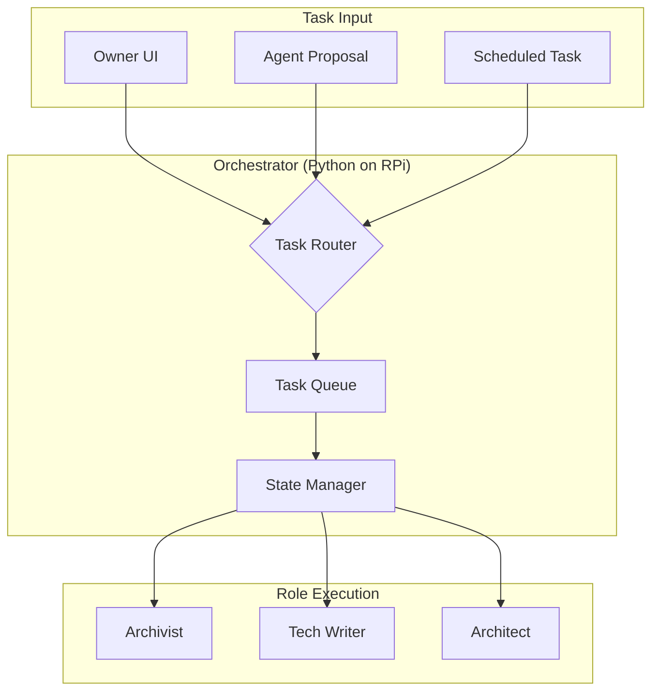
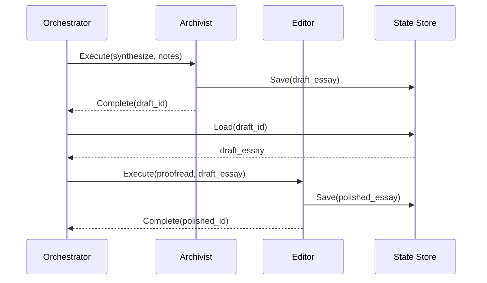

# 🔄 Оркестрація та Workflow

**Версія**: 1.0 | **Дата**: 2026-01-16

---

## 1. Orchestrator Architecture



## 2. Чи потрібен центральний Orchestrator?

**Рішення: ТАК**, але мінімалістичний.

| Підхід | Pros | Cons | Рішення |
|--------|------|------|---------|
| Без orchestrator | Простіше | Немає координації ролей | ❌ |
| Повний orchestrator (LLM) | Гнучкий | Дорого, повільно | ❌ |
| **Lightweight (Python)** | Швидко, дешево, контрольовано | Менш гнучкий | ✅ |

## 3. Маршрутизація задач

```python
# orchestrator/router.py
TASK_ROUTING = {
    # action → role mapping
    "summarize": "archivist",
    "synthesize": "archivist",
    "digest": "archivist",
    "readme": "technical_writer",
    "adr": "technical_writer",
    "api_docs": "technical_writer",
    "analyze": "architect",
    "design": "architect",
    "diagram": "architect",
}

def route_task(task: AgentTask) -> str:
    """Визначає роль для задачі"""
    return TASK_ROUTING.get(task.action, "archivist")
```

## 4. Обмін контекстом між ролями



## 5. Зберігання результатів

```
workflow:
  1. Agent генерує результат
  2. Результат → Cloudflare Worker API
  3. Worker зберігає в MinIO (content) + KV (metadata)
  4. Результат з'являється як "draft" в Digital Garden
  5. Owner переглядає → Approve → Published
```

## 6. Агент як "Співробітник"

| Традиційний API | Агент-Співробітник |
|-----------------|-------------------|
| Запит → Відповідь | Задача → Пропозиція → Схвалення → Виконання |
| Немає ініціативи | Може пропонувати задачі |
| Одноразова взаємодія | Контекст та історія |
| Немає state | Памʼятає попередні взаємодії |

---

## Наступний документ

→ [04-replit-implementation.md](./04-replit-implementation.md)
