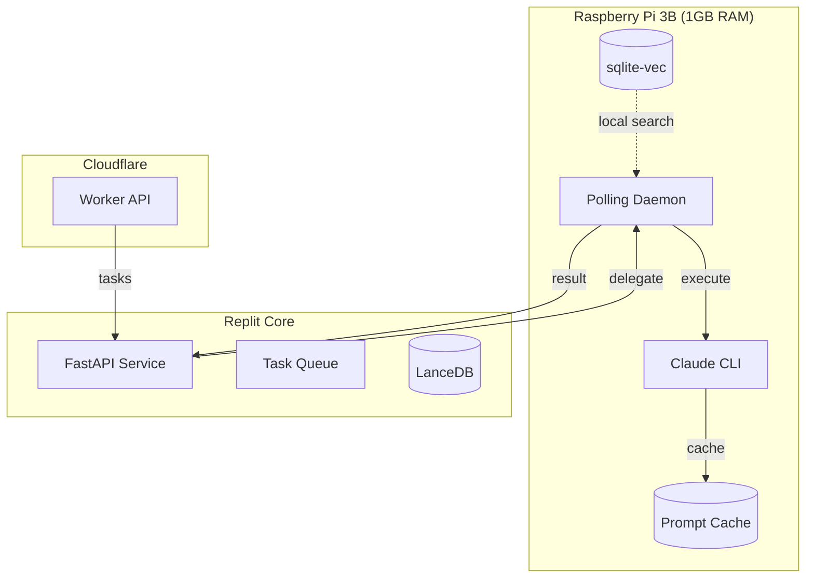
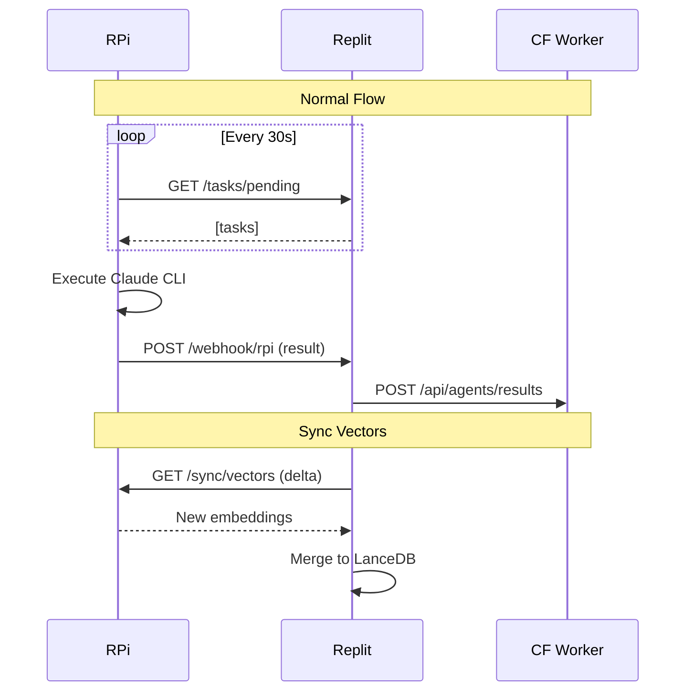

# 🍓 Інтеграція з Claude CLI (Raspberry Pi)

**Версія**: 1.0 | **Дата**: 2026-01-16

---

## Огляд архітектури



---

## Розподіл відповідальності

### Raspberry Pi робить:

| Функція | Опис | Причина |
|---------|------|---------|
| **Inference** | Виконання Claude CLI | Безкоштовний Pro доступ |
| **Prompt caching** | Зберігання system prompts | Економія токенів |
| **Локальний пошук** | sqlite-vec для швидкого пошуку | Низька latency |
| **Polling** | Отримання задач з Replit | Простота, без NAT issues |
| **Token optimization** | Truncation, chunking | Обмежене context window |

### Replit робить:

| Функція | Опис | Причина |
|---------|------|---------|
| **Orchestration** | Маршрутизація задач | Надійніший uptime |
| **Vector DB (LanceDB)** | Повноцінний семантичний пошук | Більше ресурсів |
| **API Gateway** | HTTP endpoint для Worker | Публічний доступ |
| **Fallback inference** | Якщо RPi offline | Резервування |
| **Моніторинг** | Логи, метрики | Централізація |

---

## Структура проєкту на RPi

```
garden-agent-rpi/
├── daemon.py              # Main polling daemon
├── executor.py            # Claude CLI wrapper
├── cache.py               # Prompt cache manager
├── vector.py              # sqlite-vec operations
├── config.py              # Configuration
├── requirements.txt
│
├── prompts/               # Cached system prompts
│   ├── archivist.txt
│   ├── tech_writer.txt
│   └── architect.txt
│
├── data/
│   ├── cache.db           # Prompt cache SQLite
│   └── vectors.db         # sqlite-vec database
│
└── logs/
    └── daemon.log
```

---

## Polling Daemon (`daemon.py`)

```python
#!/usr/bin/env python3
"""
Garden Agent RPi Daemon
Polls Replit for tasks, executes via Claude CLI
"""
import asyncio
import httpx
import logging
from datetime import datetime
from config import settings
from executor import ClaudeExecutor
from cache import PromptCache

logging.basicConfig(
    filename='logs/daemon.log',
    level=logging.INFO,
    format='%(asctime)s - %(levelname)s - %(message)s'
)

class AgentDaemon:
    def __init__(self):
        self.executor = ClaudeExecutor()
        self.cache = PromptCache()
        self.client = httpx.AsyncClient(
            timeout=60.0,
            headers={"X-RPi-Secret": settings.SHARED_SECRET}
        )
        self.running = False
    
    async def poll_tasks(self) -> list[dict]:
        """Fetch pending tasks from Replit"""
        try:
            response = await self.client.get(
                f"{settings.REPLIT_URL}/tasks/pending",
                params={"executor": "rpi"}
            )
            if response.status_code == 200:
                return response.json().get("tasks", [])
        except Exception as e:
            logging.error(f"Poll error: {e}")
        return []
    
    async def submit_result(self, task_id: str, result: dict):
        """Send result back to Replit"""
        try:
            await self.client.post(
                f"{settings.REPLIT_URL}/webhook/rpi",
                json={
                    "task_id": task_id,
                    "result": result,
                    "executor": "rpi",
                    "timestamp": datetime.now().isoformat()
                }
            )
            logging.info(f"Result submitted: {task_id}")
        except Exception as e:
            logging.error(f"Submit error: {e}")
    
    async def process_task(self, task: dict):
        """Process single task"""
        task_id = task["id"]
        logging.info(f"Processing task: {task_id}")
        
        try:
            # Get cached system prompt
            system_prompt = self.cache.get_prompt(task["role"])
            
            # Execute via Claude CLI
            result = await self.executor.execute(
                system_prompt=system_prompt,
                user_message=task["instruction"],
                context=task.get("context", ""),
                cache_key=f"{task['role']}_{task_id}"
            )
            
            await self.submit_result(task_id, {
                "content": result.content,
                "tokens": result.tokens_used,
                "cached": result.from_cache,
                "status": "success"
            })
            
        except Exception as e:
            logging.error(f"Task failed: {task_id} - {e}")
            await self.submit_result(task_id, {
                "status": "error",
                "error": str(e)
            })
    
    async def run(self):
        """Main daemon loop"""
        self.running = True
        logging.info("Daemon started")
        
        while self.running:
            tasks = await self.poll_tasks()
            
            for task in tasks:
                await self.process_task(task)
            
            # Rate limiting
            await asyncio.sleep(settings.POLL_INTERVAL)
        
        logging.info("Daemon stopped")
    
    def stop(self):
        self.running = False

if __name__ == "__main__":
    daemon = AgentDaemon()
    try:
        asyncio.run(daemon.run())
    except KeyboardInterrupt:
        daemon.stop()
```

---

## Claude CLI Executor (`executor.py`)

```python
"""
Claude CLI wrapper with prompt caching
"""
import subprocess
import json
import hashlib
from dataclasses import dataclass
from typing import Optional
from config import settings
from cache import PromptCache

@dataclass
class ExecutionResult:
    content: str
    tokens_used: int
    from_cache: bool
    duration_ms: int

class ClaudeExecutor:
    def __init__(self):
        self.cache = PromptCache()
        self.max_tokens = settings.MAX_OUTPUT_TOKENS
    
    def _build_prompt(self, system: str, user: str, context: str) -> str:
        """Build full prompt with context management"""
        # Token budget
        max_context_tokens = settings.MAX_CONTEXT_TOKENS
        
        # Truncate context if needed
        if len(context) > max_context_tokens * 4:  # rough char estimate
            context = self._smart_truncate(context, max_context_tokens)
        
        return f"{user}\n\n---\n\nКонтекст:\n{context}"
    
    def _smart_truncate(self, text: str, max_tokens: int) -> str:
        """Truncate preserving structure"""
        # Keep first and last sections
        chars_limit = max_tokens * 4
        if len(text) <= chars_limit:
            return text
        
        half = chars_limit // 2
        return f"{text[:half]}\n\n[... truncated ...]\n\n{text[-half:]}"
    
    def _get_cache_key(self, system: str, user: str) -> str:
        """Generate cache key for prompt"""
        content = f"{system}|{user}"
        return hashlib.sha256(content.encode()).hexdigest()[:16]
    
    async def execute(
        self,
        system_prompt: str,
        user_message: str,
        context: str = "",
        cache_key: Optional[str] = None
    ) -> ExecutionResult:
        """Execute Claude CLI command"""
        import time
        start = time.time()
        
        # Check cache first
        if cache_key:
            cached = self.cache.get_response(cache_key)
            if cached:
                return ExecutionResult(
                    content=cached,
                    tokens_used=0,
                    from_cache=True,
                    duration_ms=int((time.time() - start) * 1000)
                )
        
        # Build prompt
        full_prompt = self._build_prompt(system_prompt, user_message, context)
        
        # Execute Claude CLI
        # Using --system-prompt-file for caching
        system_file = self.cache.ensure_prompt_file(system_prompt)
        
        cmd = [
            "claude",
            "--system-prompt-file", system_file,
            "--max-tokens", str(self.max_tokens),
            "--output-format", "json",
            full_prompt
        ]
        
        try:
            result = subprocess.run(
                cmd,
                capture_output=True,
                text=True,
                timeout=settings.EXECUTION_TIMEOUT
            )
            
            if result.returncode != 0:
                raise RuntimeError(f"Claude CLI error: {result.stderr}")
            
            output = json.loads(result.stdout)
            content = output.get("content", "")
            tokens = output.get("usage", {}).get("total_tokens", 0)
            
            # Cache response
            if cache_key:
                self.cache.set_response(cache_key, content)
            
            return ExecutionResult(
                content=content,
                tokens_used=tokens,
                from_cache=False,
                duration_ms=int((time.time() - start) * 1000)
            )
            
        except subprocess.TimeoutExpired:
            raise RuntimeError("Execution timeout")
        except json.JSONDecodeError:
            raise RuntimeError("Invalid JSON response from Claude CLI")
```

---

## Prompt Cache Manager (`cache.py`)

```python
"""
Prompt caching for token optimization
"""
import sqlite3
import hashlib
import os
from pathlib import Path
from datetime import datetime, timedelta
from config import settings

class PromptCache:
    def __init__(self):
        self.db_path = settings.CACHE_DB_PATH
        self.prompts_dir = Path("prompts")
        self._init_db()
    
    def _init_db(self):
        """Initialize cache database"""
        conn = sqlite3.connect(self.db_path)
        conn.execute("""
            CREATE TABLE IF NOT EXISTS response_cache (
                cache_key TEXT PRIMARY KEY,
                response TEXT,
                created_at TIMESTAMP,
                expires_at TIMESTAMP
            )
        """)
        conn.execute("""
            CREATE TABLE IF NOT EXISTS prompt_usage (
                prompt_hash TEXT PRIMARY KEY,
                role TEXT,
                use_count INTEGER DEFAULT 0,
                last_used TIMESTAMP
            )
        """)
        conn.commit()
        conn.close()
    
    def get_prompt(self, role: str) -> str:
        """Get system prompt for role"""
        prompt_file = self.prompts_dir / f"{role}.txt"
        if prompt_file.exists():
            return prompt_file.read_text()
        raise FileNotFoundError(f"Prompt not found: {role}")
    
    def ensure_prompt_file(self, content: str) -> str:
        """Ensure prompt is in a file for CLI caching"""
        prompt_hash = hashlib.sha256(content.encode()).hexdigest()[:16]
        cache_file = Path(f"/tmp/prompt_{prompt_hash}.txt")
        
        if not cache_file.exists():
            cache_file.write_text(content)
        
        # Track usage
        self._track_usage(prompt_hash)
        
        return str(cache_file)
    
    def _track_usage(self, prompt_hash: str):
        """Track prompt usage for analytics"""
        conn = sqlite3.connect(self.db_path)
        conn.execute("""
            INSERT INTO prompt_usage (prompt_hash, use_count, last_used)
            VALUES (?, 1, ?)
            ON CONFLICT(prompt_hash) DO UPDATE SET
                use_count = use_count + 1,
                last_used = excluded.last_used
        """, (prompt_hash, datetime.now()))
        conn.commit()
        conn.close()
    
    def get_response(self, cache_key: str) -> str | None:
        """Get cached response if valid"""
        conn = sqlite3.connect(self.db_path)
        cursor = conn.execute("""
            SELECT response FROM response_cache
            WHERE cache_key = ? AND expires_at > ?
        """, (cache_key, datetime.now()))
        row = cursor.fetchone()
        conn.close()
        return row[0] if row else None
    
    def set_response(self, cache_key: str, response: str, ttl_hours: int = 24):
        """Cache response with TTL"""
        conn = sqlite3.connect(self.db_path)
        conn.execute("""
            INSERT OR REPLACE INTO response_cache
            (cache_key, response, created_at, expires_at)
            VALUES (?, ?, ?, ?)
        """, (
            cache_key,
            response,
            datetime.now(),
            datetime.now() + timedelta(hours=ttl_hours)
        ))
        conn.commit()
        conn.close()
    
    def cleanup_expired(self):
        """Remove expired cache entries"""
        conn = sqlite3.connect(self.db_path)
        conn.execute("""
            DELETE FROM response_cache WHERE expires_at < ?
        """, (datetime.now(),))
        conn.commit()
        conn.close()
```

---

## Локальний Vector Store (`vector.py`)

```python
"""
sqlite-vec for local semantic search on RPi
"""
import sqlite3
import struct
from typing import Optional
import numpy as np

# Using smaller model for RPi
from sentence_transformers import SentenceTransformer

class LocalVectorStore:
    def __init__(self, db_path: str = "data/vectors.db"):
        self.db_path = db_path
        # Lightweight model for ARM
        self.encoder = SentenceTransformer(
            "sentence-transformers/all-MiniLM-L6-v2"
        )
        self.dim = 384
        self._init_db()
    
    def _init_db(self):
        """Initialize sqlite-vec"""
        conn = sqlite3.connect(self.db_path)
        conn.enable_load_extension(True)
        conn.load_extension("vec0")  # sqlite-vec extension
        
        conn.execute(f"""
            CREATE VIRTUAL TABLE IF NOT EXISTS notes_vec
            USING vec0(
                id TEXT PRIMARY KEY,
                embedding FLOAT[{self.dim}]
            )
        """)
        
        conn.execute("""
            CREATE TABLE IF NOT EXISTS notes_meta (
                id TEXT PRIMARY KEY,
                title TEXT,
                content TEXT,
                tags TEXT,
                updated_at TIMESTAMP
            )
        """)
        
        conn.commit()
        conn.close()
    
    def _serialize_vector(self, vector: np.ndarray) -> bytes:
        """Serialize numpy array to bytes"""
        return struct.pack(f'{len(vector)}f', *vector)
    
    def embed(self, text: str) -> np.ndarray:
        """Generate embedding"""
        return self.encoder.encode(text, convert_to_numpy=True)
    
    def upsert(self, note_id: str, title: str, content: str, tags: list[str]):
        """Insert or update note with embedding"""
        embedding = self.embed(f"{title}\n{content}")
        
        conn = sqlite3.connect(self.db_path)
        conn.enable_load_extension(True)
        conn.load_extension("vec0")
        
        # Upsert vector
        conn.execute("""
            INSERT OR REPLACE INTO notes_vec (id, embedding)
            VALUES (?, ?)
        """, (note_id, self._serialize_vector(embedding)))
        
        # Upsert metadata
        conn.execute("""
            INSERT OR REPLACE INTO notes_meta
            (id, title, content, tags, updated_at)
            VALUES (?, ?, ?, ?, datetime('now'))
        """, (note_id, title, content, ",".join(tags)))
        
        conn.commit()
        conn.close()
    
    def search(self, query: str, limit: int = 5) -> list[dict]:
        """Semantic search"""
        query_embedding = self.embed(query)
        
        conn = sqlite3.connect(self.db_path)
        conn.enable_load_extension(True)
        conn.load_extension("vec0")
        
        cursor = conn.execute("""
            SELECT v.id, v.distance, m.title, m.content
            FROM notes_vec v
            JOIN notes_meta m ON v.id = m.id
            WHERE v.embedding MATCH ?
            ORDER BY v.distance
            LIMIT ?
        """, (self._serialize_vector(query_embedding), limit))
        
        results = []
        for row in cursor:
            results.append({
                "id": row[0],
                "score": 1 - row[1],  # Convert distance to similarity
                "title": row[2],
                "content": row[3][:500]  # Truncate for display
            })
        
        conn.close()
        return results
```

---

## Конфігурація (`config.py`)

```python
"""
RPi Agent Configuration
"""
import os
from dataclasses import dataclass

@dataclass
class Settings:
    # Replit connection
    REPLIT_URL: str = os.getenv("REPLIT_URL", "")
    SHARED_SECRET: str = os.getenv("SHARED_SECRET", "")
    
    # Polling
    POLL_INTERVAL: int = int(os.getenv("POLL_INTERVAL", "30"))
    
    # Claude CLI
    MAX_OUTPUT_TOKENS: int = 2000
    MAX_CONTEXT_TOKENS: int = 4000
    EXECUTION_TIMEOUT: int = 180  # 3 minutes
    
    # Cache
    CACHE_DB_PATH: str = "data/cache.db"
    RESPONSE_CACHE_TTL: int = 24  # hours
    
    # Vector
    VECTOR_DB_PATH: str = "data/vectors.db"

settings = Settings()
```

---

## Оптимізація токенів

### Стратегії

```python
# utils/token_optimizer.py

class TokenOptimizer:
    """Strategies for minimizing token usage on RPi"""
    
    @staticmethod
    def hierarchical_summary(notes: list[str], max_tokens: int) -> str:
        """
        Summarize notes hierarchically:
        1. Individual brief summaries
        2. Combined meta-summary
        """
        if len(notes) <= 3:
            return "\n\n".join(notes)
        
        # First pass: 1-sentence summaries
        summaries = []
        for note in notes:
            # Extract first paragraph or heading
            lines = note.split("\n")
            summary = next((l for l in lines if l.strip()), "")
            summaries.append(summary[:200])
        
        return "\n".join(f"• {s}" for s in summaries)
    
    @staticmethod
    def sliding_window(text: str, window_size: int, overlap: int) -> list[str]:
        """
        Split text into overlapping windows for processing
        """
        words = text.split()
        windows = []
        
        for i in range(0, len(words), window_size - overlap):
            window = words[i:i + window_size]
            windows.append(" ".join(window))
        
        return windows
    
    @staticmethod
    def importance_filter(notes: list[dict], query: str, top_k: int) -> list[dict]:
        """
        Filter to most relevant notes using keyword matching
        (lightweight alternative to embedding similarity)
        """
        query_words = set(query.lower().split())
        
        scored = []
        for note in notes:
            content_words = set(note["content"].lower().split())
            overlap = len(query_words & content_words)
            scored.append((overlap, note))
        
        scored.sort(reverse=True, key=lambda x: x[0])
        return [note for _, note in scored[:top_k]]
```

---

## Сценарії деградації

### RPi Offline

```python
# integrations/rpi_bridge.py (Replit side)

class RPiBridge:
    def __init__(self):
        self.last_heartbeat = None
        self.offline_threshold = timedelta(minutes=5)
    
    async def is_available(self) -> bool:
        """Check if RPi is online"""
        if not self.last_heartbeat:
            return False
        return datetime.now() - self.last_heartbeat < self.offline_threshold
    
    async def execute_with_fallback(self, task: Task) -> TaskResult:
        """Execute with fallback to Replit-local model"""
        if await self.is_available():
            try:
                return await self._execute_on_rpi(task)
            except TimeoutError:
                logging.warning("RPi timeout, falling back")
        
        # Fallback: use lighter model on Replit
        return await self._execute_locally(task)
    
    async def _execute_locally(self, task: Task) -> TaskResult:
        """
        Fallback execution using:
        - Ollama with small model (if available)
        - Simplified rule-based processing
        - Queue for later RPi processing
        """
        # Option 1: Queue for later
        if task.can_wait:
            await self.queue_for_rpi(task)
            return TaskResult(
                status="queued",
                message="RPi offline, queued for later"
            )
        
        # Option 2: Simplified processing
        return await self._simplified_process(task)
```

### Memory Pressure

```python
# RPi daemon memory management

import psutil

class MemoryGuard:
    MAX_MEMORY_PERCENT = 70
    
    def check_memory(self) -> bool:
        """Check if safe to process"""
        mem = psutil.virtual_memory()
        return mem.percent < self.MAX_MEMORY_PERCENT
    
    def wait_for_memory(self, timeout: int = 60):
        """Wait for memory to free up"""
        import time
        start = time.time()
        
        while not self.check_memory():
            if time.time() - start > timeout:
                raise MemoryError("Memory pressure timeout")
            time.sleep(5)
            
            # Try to free memory
            import gc
            gc.collect()
```

---

## Systemd Service

```ini
# /etc/systemd/system/garden-agent.service

[Unit]
Description=Garden AI Agent Daemon
After=network.target

[Service]
Type=simple
User=pi
WorkingDirectory=/home/pi/garden-agent-rpi
ExecStart=/home/pi/garden-agent-rpi/venv/bin/python daemon.py
Restart=always
RestartSec=10

# Memory limits for RPi
MemoryMax=512M
MemoryHigh=400M

# Environment
Environment=PYTHONUNBUFFERED=1

[Install]
WantedBy=multi-user.target
```

### Команди керування

```bash
# Встановлення
sudo systemctl enable garden-agent
sudo systemctl start garden-agent

# Моніторинг
sudo systemctl status garden-agent
journalctl -u garden-agent -f

# Перезапуск
sudo systemctl restart garden-agent
```

---

## Синхронізація з Replit



---

## Метрики та моніторинг

```python
# metrics.py

from dataclasses import dataclass, field
from datetime import datetime
from typing import Dict
import json

@dataclass
class AgentMetrics:
    tasks_processed: int = 0
    tasks_failed: int = 0
    tokens_used: int = 0
    cache_hits: int = 0
    cache_misses: int = 0
    avg_latency_ms: float = 0
    
    _latencies: list = field(default_factory=list)
    
    def record_task(self, tokens: int, latency_ms: int, from_cache: bool):
        self.tasks_processed += 1
        self.tokens_used += tokens
        
        if from_cache:
            self.cache_hits += 1
        else:
            self.cache_misses += 1
        
        self._latencies.append(latency_ms)
        self.avg_latency_ms = sum(self._latencies) / len(self._latencies)
    
    def to_dict(self) -> dict:
        return {
            "tasks_processed": self.tasks_processed,
            "tasks_failed": self.tasks_failed,
            "tokens_used": self.tokens_used,
            "cache_hit_rate": self.cache_hits / max(1, self.cache_hits + self.cache_misses),
            "avg_latency_ms": round(self.avg_latency_ms, 2)
        }
    
    def save(self, path: str = "data/metrics.json"):
        with open(path, "w") as f:
            json.dump(self.to_dict(), f)
```

---

*Документація готова. RPi daemon можна розгортати паралельно з Replit сервісом.*
