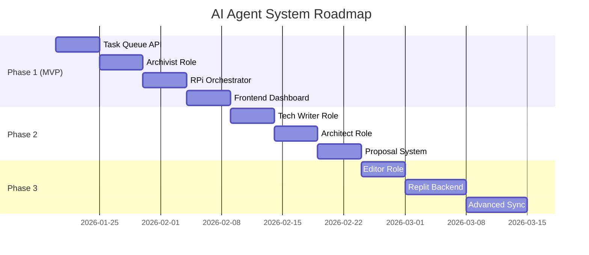

# 🗺️ Дорожня карта розробки

**Версія**: 1.0 | **Дата**: 2026-01-16

---

## Фази реалізації



---

## Phase 1: MVP (4 тижні)

### Scope
| Компонент | Deliverable | Складність |
|-----------|-------------|------------|
| Worker API | `/agents/tasks`, `/agents/results` | ⭐⭐ |
| Archivist | `summarize`, `synthesize` tasks | ⭐⭐⭐ |
| RPi Orchestrator | Polling + Claude CLI wrapper | ⭐⭐⭐ |
| sqlite-vec | Basic vector search | ⭐⭐ |
| Frontend | Task creation + status view | ⭐⭐ |

### Success Criteria
- [ ] Owner може створити summarize task через UI
- [ ] RPi виконує task і повертає результат
- [ ] Результат відображається як draft

---

## Phase 2: Extended Roles (3 тижні)

### Scope
- Technical Writer role (README, ADR)
- Architect role (diagrams, analysis)
- Proposal system (proactive suggestions)
- Editor role (proofreading)

### Success Criteria
- [ ] 3 активні ролі з унікальними prompts
- [ ] Агент може пропонувати задачі
- [ ] Pipeline виконання (Archivist → Editor)

---

## Phase 3: Cloud Integration (4 тижні)

### Scope
- Replit backend (FastAPI + LanceDB)
- RPi ↔ Replit sync
- Advanced vector search
- Batch processing

---

## Ризики

| Ризик | Ймовірність | Вплив | Mitigation |
|-------|-------------|-------|------------|
| RPi memory overflow | Medium | High | Strict limits, monitoring |
| Claude API costs | Medium | Medium | Prompt caching, budgets |
| Sync conflicts | Low | Medium | Conflict resolution logic |
| Context window limit | Low | Low | RAG chunking |

---

## Оцінка ресурсів

| Ресурс | MVP | Full System |
|--------|-----|-------------|
| Dev time | 4 weeks | 11 weeks |
| Claude API | ~$20/month | ~$40/month |
| Replit Core | $0 (MVP) | ~$7/month |
| Storage | < 1GB | < 5GB |

---

## MVP Priorities

```
1. [MUST] Task Queue API (Worker)
2. [MUST] Archivist role (summarize)
3. [MUST] RPi polling daemon
4. [MUST] Basic UI for task creation
5. [SHOULD] Vector search integration
6. [COULD] Proposal system
```

---

*Документ готовий для review. Наступний крок — узгодження Phase 1 scope та початок імплементації.*
