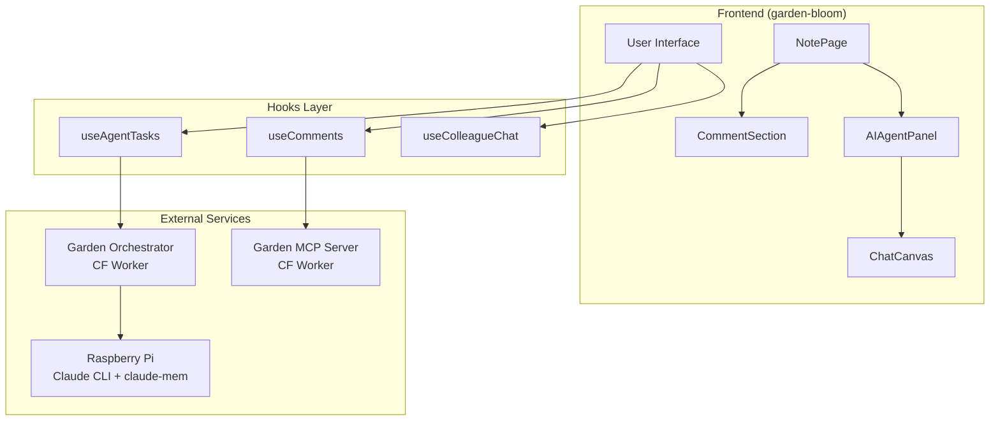
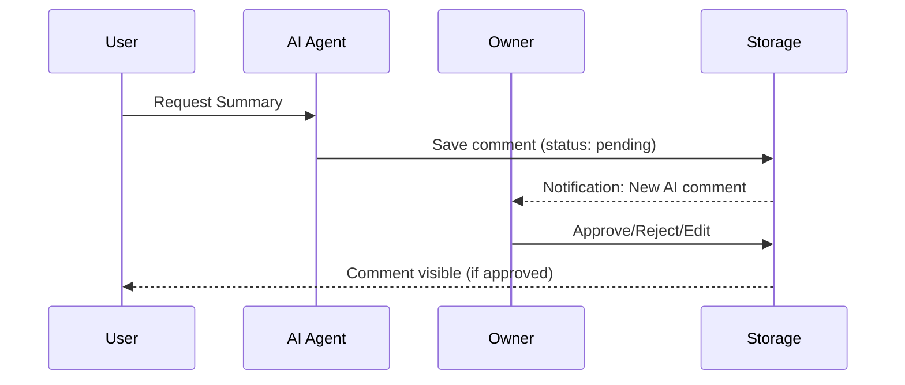

# 🎨 План Інтеграції AI-Агента у Frontend

**Версія**: 1.0 | **Дата**: 2026-01-17

---

## 📐 Загальна Архітектура Інтеграції



---

## 🎯 Точки Інтеграції

### 1. **Коментарі з AI Badge** (Існуюча система)

Розширення `CommentItem.tsx` для відображення AI-коментарів:

| Поле | Людина | AI-Агент |
|------|--------|----------|
| Avatar | `User` icon | `Bot` icon |
| Badge | "Автор" | "AI Agent" + model |
| Background | card | `purple-50/10` |
| Actions | Reply | Reply + "Merge to Note" |

### 2. **Кнопка "Request AI Summary"** (NotePage)

Додати біля секції коментарів:

```
┌─────────────────────────────────────────┐
│  📝 Note Content...                      │
├─────────────────────────────────────────┤
│  💬 Comments (3)                         │
│  ┌─────────────────────────────────────┐│
│  │ [🤖 Request AI Summary] [📊 Analyze]││
│  └─────────────────────────────────────┘│
│  ┌─────────────────────────────────────┐│
│  │ Comment 1...                        ││
│  │ Comment 2 (🤖 AI Agent)             ││
│  └─────────────────────────────────────┘│
└─────────────────────────────────────────┘
```

### 3. **AI Agent Panel** (Новий компонент)

Панель керування AI-завданнями:

```
┌─────────────────────────────────────────┐
│  🤖 AI Assistant                         │
├─────────────────────────────────────────┤
│  Quick Actions:                          │
│  [Summarize] [Digest] [Analyze Tags]    │
├─────────────────────────────────────────┤
│  Active Tasks:                           │
│  ⏳ task-123: summarize_article (35s)    │
│  ✅ task-122: create_digest (completed)  │
├─────────────────────────────────────────┤
│  Workers: 🟢 rpi-1 (online)              │
└─────────────────────────────────────────┘
```

### 4. **Chat Canvas з Колегами** (Нова функціональність)

Полотно чату для real-time взаємодії з AI:

```
┌─────────────────────────────────────────┐
│  💬 Colleagues Chat                      │
│  ─────────────────────────────────────── │
│  [Owner]: Summarize this week's notes    │
│  [Archivist 🤖]: Creating digest...      │
│  [Archivist 🤖]: ## Weekly Summary       │
│                   Key themes: AI, API... │
│  ─────────────────────────────────────── │
│  [Type message...             ] [Send]   │
└─────────────────────────────────────────┘
```

---

## 📁 Нові Файли та Компоненти

### Hooks

| Файл | Призначення |
|------|-------------|
| `useAgentTasks.ts` | CRUD для AI tasks + polling |
| `useColleagueChat.ts` | Чат з AI-агентами |
| `useAgentStatus.ts` | Статус workers (online/offline) |

### Components

| Файл | Призначення |
|------|-------------|
| `AIAgentPanel.tsx` | Головна панель AI |
| `AIAgentBadge.tsx` | Badge для AI коментарів |
| `AITaskCard.tsx` | Карточка задачі |
| `ChatCanvas.tsx` | Полотно чату |
| `ChatMessage.tsx` | Повідомлення чату |
| `ColleaguePicker.tsx` | Вибір ролі AI |

### Pages

| Файл | Призначення |
|------|-------------|
| `AIAssistantPage.tsx` | `/ai-assistant` route |
| `ChatPage.tsx` | `/chat` route (optional) |

---

## 🔄 Пріоритети Реалізації

### Phase 1: MVP (1-2 дні)
1. ✅ `useAgentTasks.ts` hook
2. ✅ Кнопка "Request AI Summary" в `NoteLayout.tsx`
3. ✅ AI Badge в `CommentItem.tsx`
4. ✅ Toast notifications для статусу

### Phase 2: AI Panel (1 день)
5. `AIAgentPanel.tsx` компонент
6. Task history list
7. Worker status indicator
8. Batch operations UI

### Phase 3: Chat Canvas (2-3 дні)
9. `ChatCanvas.tsx` з повідомленнями
10. Real-time polling / WebSocket
11. Role picker (Archivist, Tech Writer, Architect)
12. Message persistence

### Phase 4: Advanced (1 тиждень)
13. Scheduled digests UI
14. AI annotations (highlight + comment)
15. Merge AI comment to note content
16. Custom prompts editor

---

## 🧩 API Інтеграція

### Orchestrator Endpoints

```typescript
// Replit FastAPI service (MinIO-backed, replaces Cloudflare KV)
const ORCHESTRATOR = 'https://4b7cbdce-7df6-43eb-8d48-995e79525bb3-00-24u8fhavxew4n.picard.replit.dev';

// Tasks
POST   /tasks/              - Create task
GET    /tasks/{id}          - Get task status
GET    /tasks/?status=...   - List tasks
DELETE /tasks/{id}          - Cancel task

// Workers
GET    /poll/workers        - Active workers
GET    /tasks/stats/queue   - Queue statistics
```

### MCP Gateway (Comments)

```typescript
const MCP = 'https://garden-mcp-server.maxfraieho.workers.dev';

// Comments
GET    /comments/{slug}     - Fetch comments
POST   /comments/create     - Create comment
PATCH  /comments/{id}       - Update status
DELETE /comments/{id}       - Delete comment
```

---

## 🎨 Design Tokens

### AI-Specific Colors

```css
/* index.css additions */
:root {
  --ai-agent: 270 70% 60%;       /* Purple for AI */
  --ai-agent-bg: 270 70% 97%;    /* Light purple bg */
  --ai-pending: 45 90% 50%;      /* Amber for pending */
  --ai-success: 142 70% 45%;     /* Green for completed */
}

.dark {
  --ai-agent-bg: 270 30% 15%;
}
```

### Component Styles

```tsx
// AI Badge
<Badge className="bg-[hsl(var(--ai-agent)/0.1)] text-[hsl(var(--ai-agent))] border-[hsl(var(--ai-agent)/0.3)]">
  <Bot className="w-3 h-3 mr-1" />
  AI Agent
</Badge>

// AI Comment Card
<div className="bg-[hsl(var(--ai-agent-bg))] border-l-4 border-[hsl(var(--ai-agent))]">
  {/* content */}
</div>
```

---

## 🔒 Безпека та Модерація

### Owner-Only Features
- Approve/Reject AI comments
- Merge AI content to notes
- Configure AI roles & prompts
- View all pending tasks

### Guest Features
- View approved AI comments
- See AI badge on comments
- (Future) Request summary via rate-limited API

### Moderation Flow



---

## 📊 Користувацькі Сценарії

### Scenario 1: Quick Summary

```
1. User opens note "My Thoughts on AI"
2. Clicks "Request AI Summary"
3. Toast: "AI is reading your note..."
4. Spinner: 30-60 seconds
5. Toast: "Summary created!"
6. Comment appears with 🤖 badge
7. Owner approves
8. Summary visible to all
```

### Scenario 2: Weekly Digest

```
1. Owner navigates to AI Assistant
2. Clicks "Generate Weekly Digest"
3. Selects folders: journal, notes
4. Task queued
5. Raspberry Pi processes (2-3 min)
6. New note created: digests/week-3-2026
7. Owner reviews and publishes
```

### Scenario 3: Chat with AI

```
1. Owner opens Chat Canvas
2. Types: "Analyze my tag structure"
3. AI (Architect) responds with analysis
4. Owner: "Create ADR for this decision"
5. AI (Tech Writer) generates ADR
6. Result saved as draft note
```

---

## ⚡ Environment Variables

```bash
# .env.local
VITE_ORCHESTRATOR_URL=https://garden-orchestrator.maxfraieho.workers.dev
VITE_MCP_GATEWAY_URL=https://garden-mcp-server.maxfraieho.workers.dev
```

---

## 📋 Чекліст Імплементації

### Phase 1: MVP
- [ ] Додати `VITE_ORCHESTRATOR_URL` в env
- [ ] Створити `src/hooks/useAgentTasks.ts`
- [ ] Оновити `CommentItem.tsx` з AI badge
- [ ] Додати кнопку в `NoteLayout.tsx`
- [ ] Тестувати з реальною ноткою

### Phase 2: AI Panel
- [ ] Створити `AIAgentPanel.tsx`
- [ ] Додати route `/ai-assistant`
- [ ] Task list з статусами
- [ ] Worker status indicator

### Phase 3: Chat Canvas
- [ ] `ChatCanvas.tsx` component
- [ ] `useColleagueChat.ts` hook
- [ ] Message history
- [ ] Role selection UI

### Phase 4: Polish
- [ ] Responsive design
- [ ] Error handling
- [ ] Loading states
- [ ] Accessibility
- [ ] Documentation

---

## 🚀 Готовність до Імплементації

**Orchestrator API**: ✅ Online  
**MCP Gateway**: ✅ Online  
**Workers**: ⚠️ Залежить від RPi  
**Types**: ✅ Existing `CommentAuthor.type: 'ai-agent'`  

**Рекомендація**: Почати з Phase 1 (MVP) — додати кнопку та AI badge. Це займе 1-2 години та забезпечить видимий результат.

---

## Наступні Кроки

1. **Імплементувати MVP** (Phase 1)
2. **Тестувати** з реальною ноткою
3. **Ітерувати** на основі feedback
4. **Розширювати** до Chat Canvas

Ready to implement! 🚀🌱
