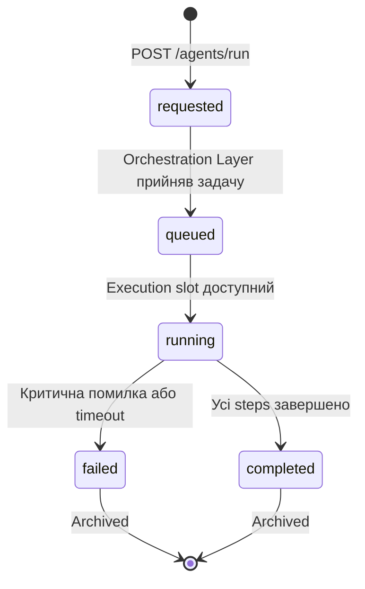
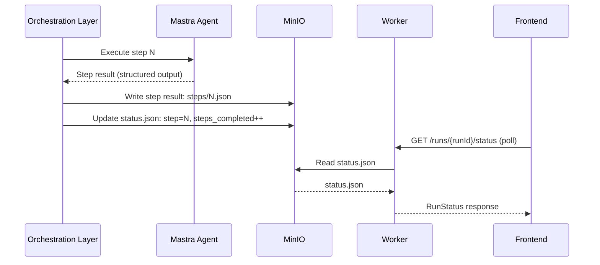

# Run Lifecycle: Канонічна специфікація

> Створено: 2026-02-15
> Автор: Головний архітектор системи
> Статус: Канонічна специфікація
> Мова: Українська (канонічна)
> Частина: RUNTIME_ARCHITECTURE_INDEX.md

---

## 0. Призначення

Цей документ описує **canonical run lifecycle** у vendor-agnostic термінах. Він визначає:

- State machine для Agent Run
- Хто встановлює кожен стан
- Інваріанти переходів
- Status Writer контракт
- Polling та notification strategy

**[ПРИНЦИП]** Run lifecycle не залежить від vendor Orchestration Layer. State machine ідентичний незалежно від того, хто координує виконання.

---

## 1. Run State Machine

### 1.1 Стани

```
[ініційовано] → requested → queued → running → completed | failed
```



### 1.2 Опис станів

| Стан | Значення | Хто встановлює | Зберігається у |
|------|---------|----------------|---------------|
| **requested** | Worker отримав запит, ще не передав Orchestration Layer | Worker | `status.json` у MinIO |
| **queued** | Orchestration Layer прийняв задачу, виконання в черзі | Orchestration Layer (через status.json) | `status.json` у MinIO |
| **running** | Mastra активно виконує steps | Orchestration Layer wrapper (через status.json) | `status.json` у MinIO |
| **completed** | Усі steps завершено, proposal(и) створено | Orchestration Layer wrapper (через status.json) | `status.json` у MinIO |
| **failed** | Критична помилка (NLM недоступний, MinIO fail, timeout, retries exhausted) | Orchestration Layer wrapper (через status.json) | `status.json` у MinIO |

### 1.3 Terminal States

**[ІНВАРІАНТ]** `completed` та `failed` є **terminal states**. Після досягнення terminal state:

- Status.json не оновлюється
- Polling зупиняється
- Run вважається archived

### 1.4 Transitions

| Перехід | Тригер | Інваріант |
|---------|--------|-----------|
| `→ requested` | Worker приймає POST /agents/run | Worker записує status.json з status=requested |
| `requested → queued` | Orchestration Layer acknowledge | Orchestration Layer оновлює status.json |
| `queued → running` | Concurrency slot вільний | Перший step починає виконання |
| `running → running` (step update) | Step завершено | steps_completed інкрементується |
| `running → completed` | Останній step успішно завершено | Manifest.json записано |
| `running → failed` | Помилка після exhaustion retries | Error записано у status.json |

### 1.5 Заборонені переходи

| Перехід | Причина |
|---------|---------|
| `completed → *` | Terminal state |
| `failed → *` | Terminal state |
| `running → requested` | Backward transition |
| `queued → requested` | Backward transition |

---

## 2. Status Writer Invariant

### 2.1 Принцип

**[ІНВАРІАНТ]** Canonical writer для `runs/<runId>/status.json` — це **Orchestration Layer wrapper**.

Mastra **НЕ** пише `status.json` напряму.

### 2.2 Потік запису



### 2.3 Обґрунтування

- **Єдиний writer** → no race conditions на status.json
- **Mastra stateless** → Mastra не знає про lifecycle, лише виконує logic
- **Orchestration Layer контролює** retry/timeout/concurrency і відображає це у status

---

## 3. Status.json Schema

### 3.1 Canonical schema

```json
{
  "run_id": "run_2026-02-14_080000_abc123",
  "agent_slug": "archivist-violin",
  "status": "running",
  "trigger": "manual",
  "started_at": "2026-02-14T08:00:00Z",
  "finished_at": null,
  "current_step": "execute-agent",
  "steps_total": 4,
  "steps_completed": 1,
  "proposals_created": [],
  "error": null
}
```

### 3.2 Terminal state examples

**Completed:**
```json
{
  "run_id": "run_2026-02-14_080000_abc123",
  "agent_slug": "archivist-violin",
  "status": "completed",
  "trigger": "manual",
  "started_at": "2026-02-14T08:00:00Z",
  "finished_at": "2026-02-14T08:03:45Z",
  "current_step": "finalize",
  "steps_total": 4,
  "steps_completed": 4,
  "proposals_created": ["prop_2026-02-14_xyz789"],
  "error": null
}
```

**Failed:**
```json
{
  "run_id": "run_2026-02-14_080000_abc123",
  "agent_slug": "archivist-violin",
  "status": "failed",
  "trigger": "cron",
  "started_at": "2026-02-14T08:00:00Z",
  "finished_at": "2026-02-14T08:02:15Z",
  "current_step": "execute-agent",
  "steps_total": 4,
  "steps_completed": 1,
  "proposals_created": [],
  "error": "AGENT_TIMEOUT: execution exceeded 600s limit"
}
```

---

## 4. Polling Strategy

### 4.1 MVP: Polling

**[РІШЕННЯ]** MVP використовує polling для оновлень стану:

| Що | Endpoint | Інтервал | Коли зупинити |
|----|----------|----------|---------------|
| Active run status | `GET /runs/{runId}/status` | 5 секунд | `status in {completed, failed}` |
| Inbox updates | `GET /inbox/stats` | 30 секунд | Сторінка закрита |
| Pending proposals | `GET /proposals/pending` | 30 секунд | Сторінка закрита |

### 4.2 Інваріанти polling

- Frontend **завжди** читає status через Worker → MinIO
- Frontend **ніколи** не звертається до Orchestration Layer API напряму
- Terminal state → polling зупиняється (no zombie polling)
- Tab visibility → polling паузиться при hidden tab

### 4.3 Майбутнє: SSE

**[РІШЕННЯ]** Опціонально у пост-MVP — Server-Sent Events замінять polling:

```
GET /events/stream
Accept: text/event-stream

data: {"type": "run.status.changed", "runId": "...", "status": "completed"}
data: {"type": "run.step.completed", "runId": "...", "step": 3}
data: {"type": "proposal.created", "proposalId": "..."}
```

SSE генерується Worker з MinIO (не з Orchestration Layer). Frontend має підтримувати fallback до polling.

---

## 5. Failure Handling

### 5.1 Retry policy

| Параметр | Значення | Обґрунтування |
|---------|---------|--------------|
| Max retries per step | 3 | Балансує recovery та швидкість failure |
| Backoff | Exponential (1s, 2s, 4s) | Захист від thundering herd |
| Per-step timeout | 120 секунд | NLM query може бути повільним |
| Per-run timeout | 600 секунд (10 хв) | Захист від зависання |

### 5.2 Failure → status.json

При failure після exhaustion retries:

1. Orchestration Layer wrapper записує error у status.json
2. Status → `failed`
3. Error містить: error code + human-readable message
4. Run вважається terminal — не retryable автоматично
5. Owner може ініціювати новий run вручну

### 5.3 Error mapping

| Ситуація | Error у status.json | HTTP error code (API) |
|---------|--------------------|-----------------------|
| NLM недоступний | `NLM_UNAVAILABLE` | 502 |
| MinIO недоступний | `UPSTREAM_UNAVAILABLE` | 502 |
| Orchestration Layer недоступний | `UPSTREAM_UNAVAILABLE` | 502 |
| Run timeout | `AGENT_TIMEOUT` | 504 |
| Step timeout | `AGENT_TIMEOUT` | 504 |
| Retries exhausted | `INTERNAL_ERROR` | 500 |
| Concurrency limit (не error) | — (status=queued) | — |

---

## Див. також

- **RUNTIME_ARCHITECTURE_CANONICAL.md** — загальна canonical архітектура
- **ORCHESTRATION_LAYER_ABSTRACTION.md** — абстракція Orchestration Layer
- **EXECUTION_PIPELINE_CANONICAL.md** — pipeline виконання
- **INBOX_AND_RUN_LIFECYCLE_V1.md** — frontend-focused витяг lifecycle
- **RUNTIME_ARCHITECTURE_INDEX.md** — master index

---

*Цей документ є канонічною специфікацією Run Lifecycle. Він vendor-agnostic за задумом.*
