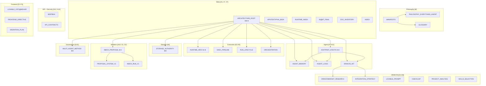

---
{"tags":["domain:meta","status:canonical","format:inventory","feature:graph"],"created":"2026-02-21","updated":"2026-02-21","tier":2,"title":"GRAPH_MAP","dg-publish":true,"dg-metatags":null,"dg-home":null,"permalink":"/exodus.pp.ua/architecture/GRAPH_MAP/","dgPassFrontmatter":true,"noteIcon":""}
---

# Garden Bloom: Граф знань (Knowledge Graph Map)

> Створено: 2026-02-21
> Автор: Головний архітектор системи
> Статус: Канонічна карта документаційного графу
> Мова: Українська (канонічна)

---

## 0. Призначення

Цей документ є **картою knowledge graph** документаційної бази Garden Bloom. Він показує:
- всі вузли (документи) та їхні ролі
- зв'язки між вузлами
- центральні вузли (хаби) та листові вузли
- домени (кластери) знань
- маршрути читання для різних контекстів

Документ оновлюється при додаванні або архівуванні документів.

---

## 1. Інвентар вузлів

### Tier 1 — Канонічні документи (авторитетне джерело)

| ID | Файл | Домен | Хаб? |
|----|------|-------|-------|
| A1 | `architecture/ARCHITECTURE_ROOT.md` | Meta | ★★★ (центральний хаб) |
| A2 | `architecture/RUNTIME_ARCHITECTURE_CANONICAL.md` | Execution | ★★ |
| A3 | `architecture/EXECUTION_PIPELINE_CANONICAL.md` | Execution | ★ |
| A4 | `architecture/RUN_LIFECYCLE_CANONICAL.md` | Execution | ★ |
| A5 | `architecture/ORCHESTRATION_LAYER_ABSTRACTION.md` | Execution | ★ |
| A6 | `architecture/STORAGE_AUTHORITY_MODEL_CANONICAL.md` | Storage | ★★ |
| A7 | `architecture/КОНТРАКТ_АГЕНТА_V1.md` | Agent | ★★ |
| A8 | `architecture/AGENT_MEMORY_GIT_DIFFMEM_V1.md` | Agent | ★ |
| A9 | `architecture/AGENT_LOGIC_VERSIONING_V1.md` | Agent | ★ |
| A10 | `architecture/INBOX_ТА_PROPOSAL_АРХІТЕКТУРА.md` | Mutation | ★★ |
| A11 | `architecture/DRAKON_ІНТЕГРАЦІЯ_ТА_МОДЕЛЬ_ВИКОНАННЯ_АГЕНТА.md` | Agent | ★ |
| A12 | `architecture/БЕЗПЕКА_СИСТЕМИ.md` | Security | leaf |
| A13 | `architecture/LANGUAGE_CANONICALIZATION.md` | Meta | leaf |
| A14 | `backend/API_CONTRACTS_V1.md` | API | ★ |
| A15 | `architecture/MULTI_AGENT_DEVELOPMENT_METHOD_CANONICAL.md` | Governance | ★★ |
| M1 | `manifesto/MANIFESTO.md` | Philosophy | ★ |
| M2 | `manifesto/PHILOSOPHY_EVERYTHING_AGENT.md` | Philosophy | leaf |
| M3 | `manifesto/GLOSSARY.md` | Philosophy | ★ |
| P1 | `PROJECT_DESCRIPTION_CANONICAL.md` | Meta | leaf |
| P2 | `product/PRODUCT_STRATEGY.md` | Product | leaf |

### Tier 2 — Допоміжні документи (витяги та implementation guides)

| ID | Файл | Домен | Відношення до Tier 1 |
|----|------|-------|----------------------|
| S1 | `architecture/PROPOSAL_SYSTEM_V1.md` | Mutation | Витяг з A10 (frontend-oriented) |
| S2 | `architecture/INBOX_AND_RUN_LIFECYCLE_V1.md` | Execution | Витяг з A10 + A4 (frontend-oriented) |
| S3 | `architecture/АРХІТЕКТУРНА_БАЗА_СИСТЕМИ.md` | Meta | Historical snapshot (2026-02-14) |
| S4 | `architecture/RUNTIME_ARCHITECTURE_INDEX.md` | Meta | Master index |
| S5 | `architecture/АРХІТЕКТУРНИЙ_АУДИТ_ТА_УЗГОДЖЕНІСТЬ_FINAL.md` | Meta | Архівний аудит |
| S6 | `architecture/DOCUMENTATION_INVENTORY.md` | Meta | Інвентар документів |
| F1 | `frontend/LOVABLE_УЗГОДЖЕННЯ_З_RUNTIME_АРХІТЕКТУРОЮ.md` | Frontend | Контракт Lovable |
| F2 | `frontend/FRONTEND_ALIGNMENT_DIRECTIVE_V1.md` | Frontend | Директива для Lovable |
| F3 | `frontend/FRONTEND_V1_MIGRATION_PLAN.md` | Frontend | Міграційний план |
| D1 | `drakon/DRAKONWIDGET_RESEARCH_UA.md` | DRAKON | Дослідження бібліотеки |
| D2 | `drakon/INTEGRATION_STRATEGY_UA.md` | DRAKON | Стратегія інтеграції |
| D3 | `drakon/LOVABLE_AGENT_PROMPT_UA.md` | DRAKON | Prompt для реалізації |
| D4 | `drakon/IMPLEMENTATION_CHECKLIST_UA.md` | DRAKON | Чеклист |
| D5 | `drakon/PROJECT_ANALYSIS_UA.md` | DRAKON | Аналіз проекту |
| D6 | `drakon/CLAUDE_SKILLS_SELECTION_UA.md` | DRAKON | Вибір skills |
| X1 | `INDEX.md` | Meta | Єдина точка входу |
| X2 | `NOTEBOOKLM_AUDIO_PROMPT.md` | Meta | Operational prompt |

---

## 2. Граф зв'язків (Tier 1)

### 2.1 Від хаба A1 (ARCHITECTURE_ROOT) виходять

```
ARCHITECTURE_ROOT (A1)
├── → STORAGE_AUTHORITY_MODEL_CANONICAL (A6)    [Axiom A1]
├── → INBOX_ТА_PROPOSAL_АРХІТЕКТУРА (A10)       [Axiom A2]
├── → RUNTIME_ARCHITECTURE_CANONICAL (A2)       [Axiom A3]
├── → ORCHESTRATION_LAYER_ABSTRACTION (A5)      [Axiom A4]
├── → EXECUTION_PIPELINE_CANONICAL (A3)         [§5 canonical flow]
├── → RUN_LIFECYCLE_CANONICAL (A4)              [§5 run states]
├── → КОНТРАКТ_АГЕНТА_V1 (A7)                  [Axiom A3, A7]
├── → AGENT_MEMORY_GIT_DIFFMEM_V1 (A8)         [Axiom A1, A7]
├── → AGENT_LOGIC_VERSIONING_V1 (A9)           [Axiom A2]
└── → DRAKON_ІНТЕГРАЦІЯ (A11)                  [Axiom A3, A7]
```

### 2.2 Execution кластер

```
RUNTIME_ARCHITECTURE_CANONICAL (A2)
├── → EXECUTION_PIPELINE_CANONICAL (A3)
├── → ORCHESTRATION_LAYER_ABSTRACTION (A5)
├── → КОНТРАКТ_АГЕНТА_V1 (A7)
└── → STORAGE_AUTHORITY_MODEL_CANONICAL (A6)

EXECUTION_PIPELINE_CANONICAL (A3)
├── → ORCHESTRATION_LAYER_ABSTRACTION (A5)
├── → RUN_LIFECYCLE_CANONICAL (A4)
├── → STORAGE_AUTHORITY_MODEL_CANONICAL (A6)
├── → AGENT_MEMORY_GIT_DIFFMEM_V1 (A8)
└── → INBOX_ТА_PROPOSAL_АРХІТЕКТУРА (A10)

RUN_LIFECYCLE_CANONICAL (A4)
├── → RUNTIME_ARCHITECTURE_CANONICAL (A2)
└── → INBOX_ТА_PROPOSAL_АРХІТЕКТУРА (A10)
```

### 2.3 Agent кластер

```
КОНТРАКТ_АГЕНТА_V1 (A7)
├── → AGENT_MEMORY_GIT_DIFFMEM_V1 (A8)
├── → AGENT_LOGIC_VERSIONING_V1 (A9)
├── → DRAKON_ІНТЕГРАЦІЯ (A11)
├── → INBOX_ТА_PROPOSAL_АРХІТЕКТУРА (A10)
└── → RUNTIME_ARCHITECTURE_CANONICAL (A2)

AGENT_MEMORY_GIT_DIFFMEM_V1 (A8)
├── → КОНТРАКТ_АГЕНТА_V1 (A7)
├── → INBOX_ТА_PROPOSAL_АРХІТЕКТУРА (A10)
└── → STORAGE_AUTHORITY_MODEL_CANONICAL (A6)

AGENT_LOGIC_VERSIONING_V1 (A9)
├── → КОНТРАКТ_АГЕНТА_V1 (A7)
├── → INBOX_ТА_PROPOSAL_АРХІТЕКТУРА (A10)
└── → AGENT_MEMORY_GIT_DIFFMEM_V1 (A8)

DRAKON_ІНТЕГРАЦІЯ (A11)
├── → КОНТРАКТ_АГЕНТА_V1 (A7)
├── → RUNTIME_ARCHITECTURE_CANONICAL (A2)
└── → AGENT_LOGIC_VERSIONING_V1 (A9)
```

### 2.4 Mutation кластер

```
INBOX_ТА_PROPOSAL_АРХІТЕКТУРА (A10)
├── → STORAGE_AUTHORITY_MODEL_CANONICAL (A6)
├── → AGENT_MEMORY_GIT_DIFFMEM_V1 (A8)
├── → AGENT_LOGIC_VERSIONING_V1 (A9)
├── → RUN_LIFECYCLE_CANONICAL (A4)
└── → БЕЗПЕКА_СИСТЕМИ (A12)
```

### 2.5 Governance кластер

```
MULTI_AGENT_DEVELOPMENT_METHOD_CANONICAL (A15)
├── → ARCHITECTURE_ROOT (A1)                        [батько, §1.3]
├── → RUNTIME_ARCHITECTURE_CANONICAL (A2)           [related]
├── → STORAGE_AUTHORITY_MODEL_CANONICAL (A6)        [write-authority джерело]
├── → EXECUTION_PIPELINE_CANONICAL (A3)             [lifecycle контекст]
├── → INBOX_ТА_PROPOSAL_АРХІТЕКТУРА (A10)           [proposal system]
├── → KNOWLEDGE_GRAPH_INVARIANTS (KG1)              [INV-MADM-* набір]
├── → TAGGING_SYSTEM_CANONICAL (S7)                 [tag governance]
└── → GRAPH_MAP (this)                              [реєстрація вузла]
```

### 2.6 API та Frontend кластер

```
API_CONTRACTS_V1 (A14)
├── ← INBOX_ТА_PROPOSAL_АРХІТЕКТУРА (A10)     [джерело §1-3]
├── ← RUNTIME_ARCHITECTURE_CANONICAL (A2)     [джерело §2.5]
└── → БЕЗПЕКА_СИСТЕМИ (A12)                   [auth specs]

БЕЗПЕКА_СИСТЕМИ (A12)
├── → КОНТРАКТ_АГЕНТА_V1 (A7)
├── → INBOX_ТА_PROPOSAL_АРХІТЕКТУРА (A10)
├── → RUNTIME_ARCHITECTURE_CANONICAL (A2)
└── → STORAGE_AUTHORITY_MODEL_CANONICAL (A6)
```

### 2.6 Philosophy кластер

```
MANIFESTO (M1)
├── → PHILOSOPHY_EVERYTHING_AGENT (M2)
├── → GLOSSARY (M3)
└── → [ідейна база для всіх архітектурних рішень]

PHILOSOPHY_EVERYTHING_AGENT (M2)
├── → MANIFESTO (M1)
├── → КОНТРАКТ_АГЕНТА_V1 (A7)
└── → RUNTIME_ARCHITECTURE_CANONICAL (A2)

GLOSSARY (M3)
├── → MANIFESTO (M1)
└── → ARCHITECTURE_ROOT (A1)
```

---

## 3. Центральні вузли (хаби)

### Хаб 1: ARCHITECTURE_ROOT (A1)
**Вхідний ступінь:** 0 (корінь, без батьків)
**Вихідний ступінь:** 10 (виходи до всіх canonical docs)
**Роль:** Аксіоматичний корінь — стартова точка для будь-якого читача

### Хаб 2: RUNTIME_ARCHITECTURE_CANONICAL (A2)
**Вхідний ступінь:** 4+
**Вихідний ступінь:** 4
**Роль:** Операційний хаб — зводить execution, storage, orchestration

### Хаб 3: INBOX_ТА_PROPOSAL_АРХІТЕКТУРА (A10)
**Вхідний ступінь:** 5+
**Вихідний ступінь:** 5
**Роль:** Mutation хаб — consent-based mutation, повна специфікація

### Хаб 4: КОНТРАКТ_АГЕНТА_V1 (A7)
**Вхідний ступінь:** 4+
**Вихідний ступінь:** 5
**Роль:** Agent хаб — центр агентного кластера

### Хаб 5: STORAGE_AUTHORITY_MODEL_CANONICAL (A6)
**Вхідний ступінь:** 5+
**Вихідний ступінь:** 2
**Роль:** Write-authority хаб — єдине джерело правди про права доступу

---

## 4. Листові вузли та ізольовані документи

### Листові вузли (висока вхідність, мала вихідність)

| Вузол | Вхідний ступінь | Вихідний ступінь | Тип |
|-------|-----------------|------------------|-----|
| `БЕЗПЕКА_СИСТЕМИ` (A12) | 3 | 4 | Security leaf |
| `LANGUAGE_CANONICALIZATION` (A13) | 2 | 3 | Policy leaf |
| `PROJECT_DESCRIPTION_CANONICAL` (P1) | 1 | 0 | Meta leaf |
| `PRODUCT_STRATEGY` (P2) | 1 | 3 | Product leaf |
| `NOTEBOOKLM_AUDIO_PROMPT` (X2) | 0 | 0 | **Ізольований** |

### Зауваження щодо ізольованих вузлів

- `NOTEBOOKLM_AUDIO_PROMPT.md` — operational prompt, ізольований навмисне. Не потрібний у Zettelkasten-зв'язках.
- `PROJECT_DESCRIPTION_CANONICAL.md` — написаний англійською (виняток). Деталізує ARCHITECTURE_ROOT, але не має зворотного зв'язку.

---

## 5. Домени (кластери знань)



---

## 6. Маршрути читання

### Маршрут А: Нова людина (концепції)
```
MANIFESTO → PHILOSOPHY_EVERYTHING_AGENT → ARCHITECTURE_ROOT → RUNTIME_ARCHITECTURE_CANONICAL → КОНТРАКТ_АГЕНТА_V1
```

### Маршрут Б: Frontend розробник
```
ARCHITECTURE_ROOT → INBOX_AND_RUN_LIFECYCLE_V1 → PROPOSAL_SYSTEM_V1 → API_CONTRACTS_V1 → LOVABLE_УЗГОДЖЕННЯ → FRONTEND_ALIGNMENT_DIRECTIVE_V1
```

### Маршрут В: Backend / Gateway розробник
```
ARCHITECTURE_ROOT → RUNTIME_ARCHITECTURE_CANONICAL → STORAGE_AUTHORITY_MODEL_CANONICAL → EXECUTION_PIPELINE_CANONICAL → API_CONTRACTS_V1 → БЕЗПЕКА_СИСТЕМИ
```

### Маршрут Г: Agent / Runtime розробник
```
ARCHITECTURE_ROOT → КОНТРАКТ_АГЕНТА_V1 → AGENT_MEMORY_GIT_DIFFMEM_V1 → AGENT_LOGIC_VERSIONING_V1 → DRAKON_ІНТЕГРАЦІЯ → ORCHESTRATION_LAYER_ABSTRACTION
```

### Маршрут Д: Архітектор (full context)
```
ARCHITECTURE_ROOT → RUNTIME_ARCHITECTURE_CANONICAL → всі Tier 1 → АРХІТЕКТУРНИЙ_АУДИТ_FINAL
```

---

## 7. Аналіз стану графу

### Сильні сторони

- **Більшість Tier 1 документів** мають "Семантичні зв'язки" секції з [[wiki-links\|wiki-links]]
- **ARCHITECTURE_ROOT** є чітким аксіоматичним коренем з повним Semantic Map (§6)
- **Execution кластер** (A2-A5) добре пов'язаний
- **Agent кластер** (A7-A11) добре пов'язаний

### Додані вузли у цій ітерації

| Файл | Роль | Tier |
|------|------|------|
| `architecture/TAGGING_SYSTEM_CANONICAL.md` | Canonical spec системи тегування | 2 |
| `architecture/KNOWLEDGE_GRAPH_INVARIANTS.md` | Rule base для semantic-guard та graph-linter | 2 |
| `architecture/MULTI_AGENT_DEVELOPMENT_METHOD_CANONICAL.md` | Governance: ролі агентів, authority model, mutation governance, safety invariants (INV-MADM-*) | 1 |

### Виправлено у цій ітерації

| Проблема | Вирішення |
|----------|-----------|
| БЕЗПЕКА_СИСТЕМИ.md — відсутні "Семантичні зв'язки" | Додано секцію |
| PHILOSOPHY_EVERYTHING_AGENT.md — відсутні "Семантичні зв'язки" | Додано секцію |
| LANGUAGE_CANONICALIZATION.md — відсутні посилання | Додано "Пов'язані нотатки" |
| Відсутній GRAPH_MAP.md | Створено цей документ |
| PROJECT_DESCRIPTION_CANONICAL.md — відсутні "Семантичні зв'язки" | Додано секцію |
| PRODUCT_STRATEGY.md — відсутні "Семантичні зв'язки" | Додано секцію |
| API_CONTRACTS_V1.md — лише неформальний "Div. також" | Додано "Семантичні зв'язки" секцію |
| INDEX.md — GRAPH_MAP.md не згадано | Додано посилання у Tier 2 та intro |
| ARCHITECTURE_ROOT.md §Семантичні зв'язки — не посилається на GRAPH_MAP | Додано рядок |

### Зони уваги (не блокуючі)

| Зона | Опис |
|------|------|
| `NOTEBOOKLM_AUDIO_PROMPT.md` | Ізольований вузол — без зв'язків. Навмисний (operational prompt) |
| DRAKON кластер (D1-D6) | Добре внутрішньо зв'язаний, але слабо пов'язаний із Tier 1 (тільки через A11) |
| `АРХІТЕКТУРНА_БАЗА_СИСТЕМИ.md` | Historical snapshot. Чітко помічена в ARCHITECTURE_ROOT §7 |

### Відмінність ролей: ARCHITECTURE_ROOT vs АРХІТЕКТУРНА_БАЗА_СИСТЕМИ

**[РІШЕННЯ — не змінювати]**

| Документ | Роль | Дата | Статус |
|----------|------|------|--------|
| `ARCHITECTURE_ROOT.md` | Аксіоми ЗАПЛАНОВАНОЇ системи | 2026-02-21 | Canonical |
| `АРХІТЕКТУРНА_БАЗА_СИСТЕМИ.md` | Snapshot ФАКТИЧНОГО стану | 2026-02-14 | Historical |

Обидва документи лишаються. Вони доповнюють, а не дублюють один одного.

---

## Семантичні зв'язки

**Цей документ є частиною:**
- [[exodus.pp.ua/architecture/ARCHITECTURE_ROOT\|ARCHITECTURE_ROOT]] — §6 Semantic Map є початковою точкою графу

**Цей документ деталізує:**
- [[exodus.pp.ua/INDEX\|INDEX]] — маршрути читання з §2

**Від цього документа залежать:**
- [[exodus.pp.ua/INDEX\|INDEX]] — для орієнтації нового читача
- [[exodus.pp.ua/architecture/DOCUMENTATION_INVENTORY\|DOCUMENTATION_INVENTORY]] — inventory статус кожного вузла

---

*Цей документ є картою knowledge graph документаційної бази Garden Bloom. Оновлюється при змінах структури документації.*
