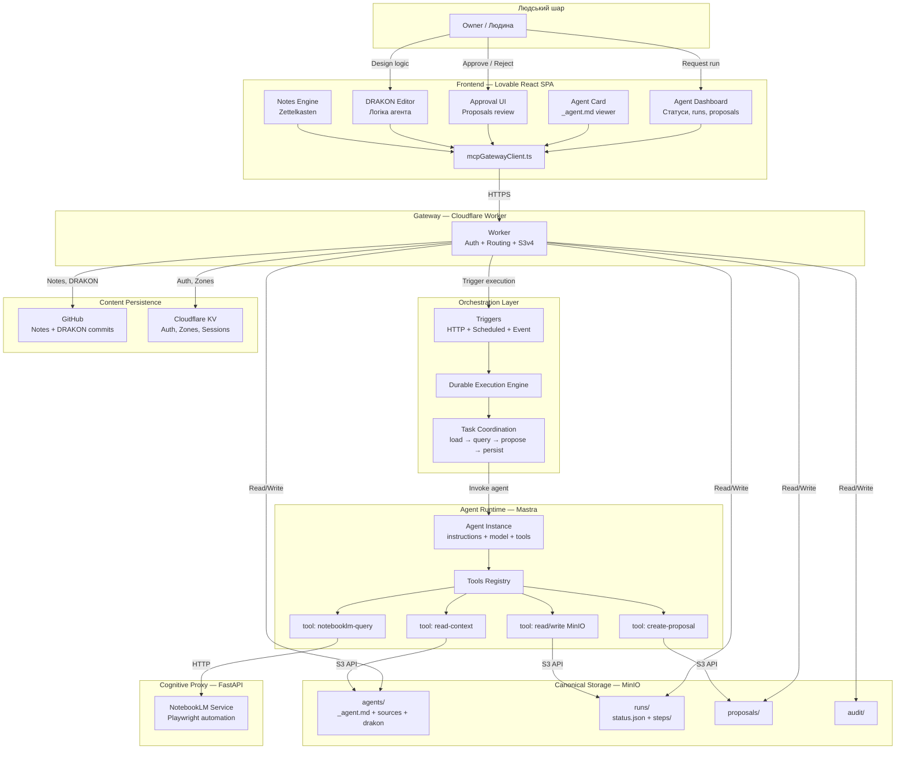
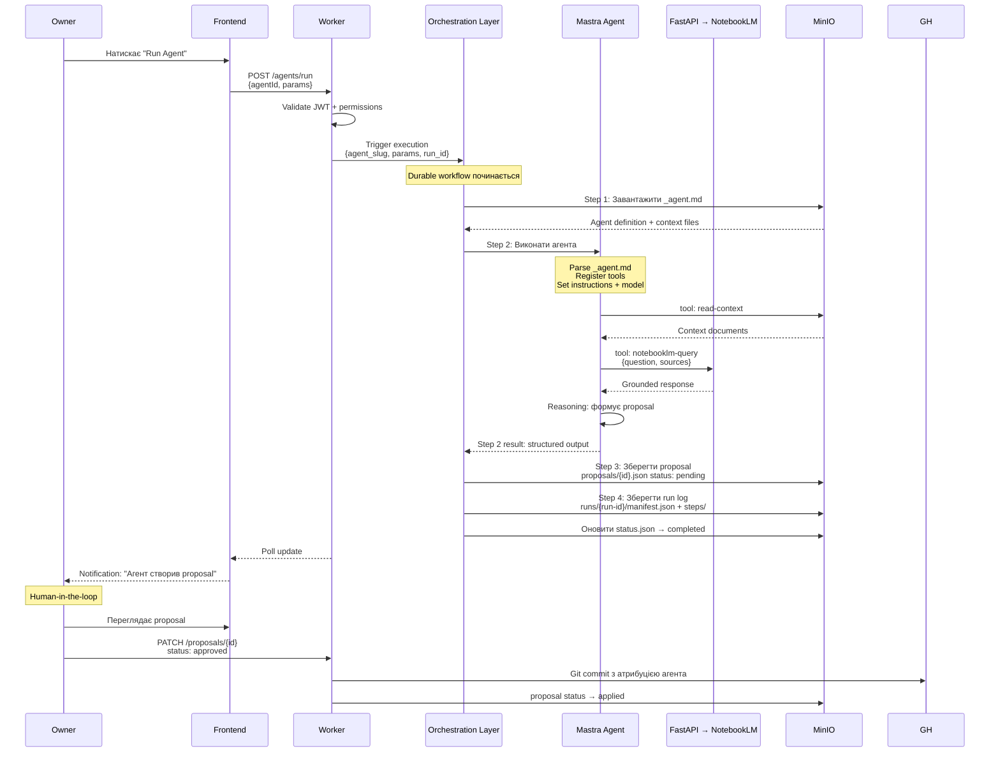

---
{"tags":["domain:arch","status:canonical","format:spec","feature:execution"],"created":"2026-02-21","updated":"2026-02-21","tier":1,"title":"КАНОНІЧНА АРХІТЕКТУРА ВИКОНАННЯ","dg-publish":true,"dg-metatags":null,"dg-home":null,"permalink":"/exodus.pp.ua/architecture/core/КАНОНІЧНА_АРХІТЕКТУРА_ВИКОНАННЯ/","dgPassFrontmatter":true,"noteIcon":""}
---


# Канонічна архітектура runtime

> Створено: 2026-02-15
> Автор: Головний архітектор системи
> Статус: Канонічна специфікація
> Мова: Українська (канонічна)
> Замінює: ЦІЛЬОВА_АРХІТЕКТУРА_MASTRA_INNGEST.md (vendor-specific)

---

## 0. Призначення

Цей документ є **канонічним описом runtime-архітектури** Garden Seedling. Він описує систему у vendor-agnostic термінах. Жоден конкретний vendor не є архітектурною залежністю.

**[ПРИНЦИП]** Архітектура описує **ролі та контракти**, не реалізації. Реалізація orchestration layer може бути Trigger.dev, Temporal, BullMQ, Celery або custom — без архітектурних змін.

---

## 1. Фундаментальні інваріанти

**[ПРИНЦИП]** Runtime-компоненти (Mastra, Orchestration Layer) **НЕ є джерелами істини**. Вони є виконавцями та координаторами. Канонічним сховищем є MinIO.

| Компонент | Що він зберігає | Що він НЕ зберігає |
|-----------|----------------|-------------------|
| **MinIO** | Визначення агентів, результати виконання, proposals, артефакти, аудит-лог | — |
| **Mastra** | Тимчасовий стан виконання агента (in-memory) | Персистентні дані, визначення агентів, результати |
| **Orchestration Layer** | Стан координації workflow (durable execution) | Бізнес-дані, файли, визначення агентів |

**[ПРИНЦИП]** Якщо Mastra або Orchestration Layer втрачають стан — система відновлюється з MinIO. Якщо MinIO втрачає дані — система втрачає дані. Це асиметрія за задумом.

**[ПРИНЦИП]** Агент не має права мовчки змінювати знання. Будь-який результат агента проходить через proposal → approval → apply.

---

## 2. Ролі компонентів

### 2.1 MinIO — канонічна файлова система агентів

**[РІШЕННЯ]** MinIO є **повною файловою системою агентної підсистеми**.

```
garden-agents/
├── agents/
│   └── {slug}/
│       ├── _agent.md                   ← визначення агента
│       ├── pseudocode.md               ← behavioral contract
│       ├── sources/                    ← джерела знань
│       ├── drakon/                     ← DRAKON-діаграми
│       ├── memory/                     ← пам'ять агента
│       ├── runs/                       ← журнал виконань
│       │   └── {run-id}/
│       │       ├── status.json
│       │       ├── manifest.json
│       │       └── steps/
│       ├── proposals/                  ← proposals від агента
│       └── artifacts/                  ← довготривалі артефакти
│
├── system/                             ← глобальні policies, schemas
├── zones/                              ← зони з inbox та sources
├── audit/                              ← аудит-лог
└── agents/index.json                   ← реєстр (кеш, не SoT)
```

**[ПРИНЦИП]** Визначення агента (`_agent.md`) зберігається у MinIO, не у runtime. Mastra завантажує визначення при кожному запуску і не кешує між запусками.

### 2.2 FastAPI — когнітивний проксі до NotebookLM

**[РІШЕННЯ]** Роль FastAPI не змінюється. Він залишається єдиним шляхом до NotebookLM.

**[ОБМЕЖЕННЯ]** FastAPI **не знає** про Mastra чи Orchestration Layer. Він надає HTTP API, яке викликається як інструмент (tool) агента через Mastra.

### 2.3 Orchestration Layer — координація виконання

**[РІШЕННЯ]** Orchestration Layer відповідає за **коли**, **в якому порядку** та **з якою надійністю** виконуються кроки агента.

Orchestration Layer забезпечує:

| Можливість | Застосування у системі |
|-----------|----------------------|
| **Event/trigger-driven запуск** | Подія або HTTP-виклик ініціює виконання агента |
| **Durable execution** | Кожен крок зберігає стан; при збої — retry з останнього успішного кроку |
| **Step-based workflows** | Етапи: load context → query NLM → generate proposal → persist to MinIO |
| **Concurrency control** | Обмеження одночасних запусків одного агента |
| **Scheduled execution** | Планове виконання агентів за розкладом (cron) |
| **Timeouts** | Захист від зависання (120с на крок, 600с на run) |
| **Retries з backoff** | Автоматичне повторення при транзієнтних помилках |

**[ПРИНЦИП]** Orchestration Layer **не містить бізнес-логіки агентів**. Він містить лише координаційну обгортку: послідовність кроків, retry-політику, timeout-и. Логіка агента живе у Mastra.

**[ПРИНЦИП]** Orchestration Layer є **замінним компонентом**. Будь-яка система, що реалізує capabilities з таблиці вище, може слугувати Orchestration Layer. Це архітектурне рішення, не vendor lock-in.

**[ОБМЕЖЕННЯ]** Orchestration Layer зберігає тимчасовий стан workflow у власному execution engine. Цей стан є **ефемерним** — після завершення workflow, канонічний результат записується у MinIO.

### 2.4 Mastra — runtime-інтерпретатор агентів

**[РІШЕННЯ]** Mastra відповідає за **як** агент думає та діє. Це runtime, де `_agent.md` перетворюється на працюючого агента.

| Можливість | Застосування у системі |
|-----------|----------------------|
| **Agent class** | Визначення агента з instructions, model, tools |
| **Tool registration** | Підключення інструментів: `notebooklm-query`, `propose-edit`, `read-context` |
| **LLM orchestration** | Виклик моделі (Claude, GPT-4) з інструкціями агента |
| **Step iteration** | `maxSteps` контролює глибину мислення агента |
| **Structured output** | Агент повертає типізований результат (proposal, summary, tag) |

**[ПРИНЦИП]** Mastra **не зберігає стан між запусками**. Кожне виконання — чисте: завантаження `_agent.md` з MinIO → ініціалізація → виконання → результат у MinIO.

### 2.5 Cloudflare Worker — gateway

**[РІШЕННЯ]** Worker залишається **єдиною точкою входу** для всієї комунікації frontend → backend.

**[ПРИНЦИП]** Frontend ніколи не звертається до Mastra, Orchestration Layer чи FastAPI напряму.

### 2.6 Lovable Frontend — проєкція стану

**[РІШЕННЯ]** Frontend відображає стан агентної системи, але **не керує виконанням напряму**. Управління відбувається через Gateway (Worker), який делегує Orchestration Layer.

**[ПРИНЦИП]** Frontend не знає про реалізацію Orchestration Layer. Він оперує абстракціями: agent, run, step, proposal. Зміна orchestrator не вимагає змін frontend.

---

## 3. Архітектурна діаграма

### 3.1 Загальна архітектура



### 3.2 Послідовність виконання агента



---

## 4. Межі відповідальності

### 4.1 Матриця відповідальності

| Функція | MinIO | FastAPI | Orchestration Layer | Mastra | Worker | Frontend |
|---------|-------|---------|---------------------|--------|--------|----------|
| Зберігання визначень агентів | **Canonical** | — | — | — | Proxy | Read |
| Зберігання результатів | **Canonical** | — | Temp (ефемерний) | — | Proxy | Read |
| Cognitive reasoning (NLM) | — | **Execute** | — | Tool call | — | UI |
| Координація workflow | — | — | **Execute** | — | Trigger | Monitor |
| Інтерпретація `_agent.md` | — | — | — | **Execute** | — | Display |
| Автентифікація | — | — | — | — | **Execute** | Initiate |
| Approval proposals | — | — | — | — | **Execute** | **UI** |
| Git persistence | — | Proxy | — | — | **Execute** | Trigger |
| Аудит | **Store** | — | — | — | Write | Read |

### 4.2 Заборони компонентів

**Orchestration Layer НЕ повинен:**
- Містити бізнес-логіку агентів (лише координація)
- Зберігати канонічні дані
- Мати прямий доступ до frontend
- Викликати NotebookLM напряму (лише через Mastra tool)
- Визначати, що робить агент (це роль `_agent.md`)

**Mastra НЕ повинен:**
- Зберігати стан між запусками
- Планувати виконання (це роль Orchestration Layer)
- Писати `status.json` напряму (це роль Orchestration Layer wrapper)
- Обходити proposal → approval цикл

**Frontend НЕ повинен:**
- Звертатися до Mastra, Orchestration Layer, FastAPI, MinIO напряму
- Знати про реалізацію Orchestration Layer
- Зберігати стан агентів (лише відображає)

---

## 5. Deployment topology

**[РІШЕННЯ]** Mastra та Orchestration Layer розгортаються як **єдиний Node.js/TypeScript сервіс** (Agent Service).

```
┌─────────────────────────────────────────────────┐
│          Agent Service (Node.js/TypeScript)       │
│                                                   │
│   ┌──────────────┐    ┌──────────────────────┐   │
│   │ Orchestration │    │   Mastra              │   │
│   │ Layer Adapter │    │   Agent Runtime       │   │
│   │              │    │                        │   │
│   │ Tasks:        │    │   Agents:              │   │
│   │ - agent-run   │◄──►│   - dynamic from       │   │
│   │ - agent-cron  │    │     _agent.md          │   │
│   │              │    │                        │   │
│   │ Config:       │    │   Tools:               │   │
│   │ - retries     │    │   - notebooklm-query   │   │
│   │ - concurrency │    │   - read-context        │   │
│   │ - timeouts    │    │   - create-proposal     │   │
│   └──────────────┘    └──────────────────────┘   │
│                                                   │
│   HTTP endpoint: Orchestration Layer webhook      │
└─────────────────────────────────────────────────┘
         │                          │
         ▼                          ▼
  Orchestration Service       MinIO + FastAPI
  (cloud або self-hosted)
```

**[ПРИНЦИП]** Orchestration Layer може працювати як managed cloud service або self-hosted. Архітектура не залежить від deployment model.

---

## 6. Ризики та обмеження

| Ризик | Опис | Мітигація |
|-------|------|-----------|
| **Додаткова інфраструктура** | Agent Service потребує хостингу | Replit, Railway, або self-hosted |
| **Orchestrator maturity** | Обраний orchestrator може мати обмеження | Adapter interface ізолює від vendor |
| **Mastra maturity** | Фреймворк молодий | TypeScript, відкритий код, активна розробка |
| **NotebookLM bottleneck** | Єдиний cognitive engine; browser automation | Ізольований за FastAPI інтерфейсом |
| **Складність налагодження** | Три сервіси (Worker + Agent Service + FastAPI) | Аудит-лог у MinIO; Orchestration Layer dashboard |

---

## Див. також

- **АБСТРАКЦІЯ_РІВНЯ_ОРКЕСТРАЦІЇ.md** — абстракція Orchestration Layer
- **КАНОНІЧНИЙ_ЦИКЛ_ЗАПУСКУ.md** — canonical run lifecycle
- **КАНОНІЧНИЙ_КОНВЕЄР_ВИКОНАННЯ.md** — execution pipeline
- **КАНОНІЧНА_МОДЕЛЬ_АВТОРИТЕТУ_СХОВИЩА.md** — storage authority
- **ІНДЕКС_АРХІТЕКТУРИ_ВИКОНАННЯ.md** — master index

---

*Цей документ є канонічним описом runtime-архітектури Garden Seedling. Він замінює vendor-specific ЦІЛЬОВА_АРХІТЕКТУРА_MASTRA_INNGEST.md.*

---

## Семантичні зв'язки

**Цей документ деталізує:**
- [[exodus.pp.ua/architecture/foundation/АРХІТЕКТУРНИЙ_КОРІНЬ\|АРХІТЕКТУРНИЙ_КОРІНЬ]] — аксіоми A3 (stateless runtime), A4 (replaceable orchestration), A5 (gateway), A6 (frontend isolation)

**Цей документ залежить від:**
- [[exodus.pp.ua/architecture/core/АБСТРАКЦІЯ_РІВНЯ_ОРКЕСТРАЦІЇ\|АБСТРАКЦІЯ_РІВНЯ_ОРКЕСТРАЦІЇ]] — Hatchet adapter contract
- [[exodus.pp.ua/architecture/core/КАНОНІЧНА_МОДЕЛЬ_АВТОРИТЕТУ_СХОВИЩА\|КАНОНІЧНА_МОДЕЛЬ_АВТОРИТЕТУ_СХОВИЩА]] — authority model для кожного компонента
- [[exodus.pp.ua/architecture/core/КОНТРАКТ_АГЕНТА_V1\|КОНТРАКТ_АГЕНТА_V1]] — що Mastra отримує і що повертає

**Від цього документа залежать:**
- [[exodus.pp.ua/architecture/core/КАНОНІЧНИЙ_КОНВЕЄР_ВИКОНАННЯ\|КАНОНІЧНИЙ_КОНВЕЄР_ВИКОНАННЯ]] — pipeline є деталізацією runtime flow
- [[exodus.pp.ua/architecture/core/КАНОНІЧНИЙ_ЦИКЛ_ЗАПУСКУ\|КАНОНІЧНИЙ_ЦИКЛ_ЗАПУСКУ]] — state machine реалізується в runtime
- [[exodus.pp.ua/architecture/core/INBOX_ТА_PROPOSAL_АРХІТЕКТУРА\|INBOX_ТА_PROPOSAL_АРХІТЕКТУРА]] — proposals — вихід runtime execution
