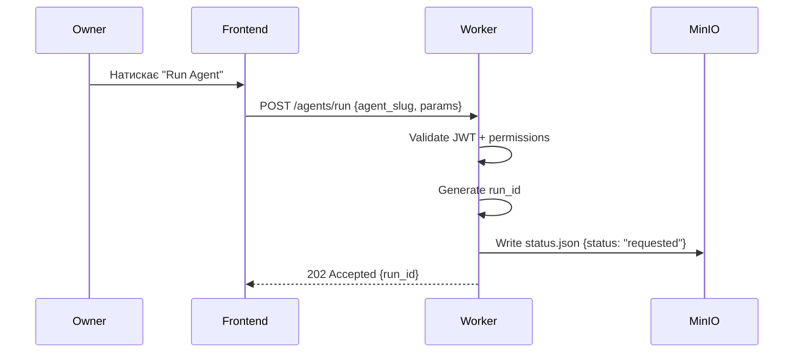
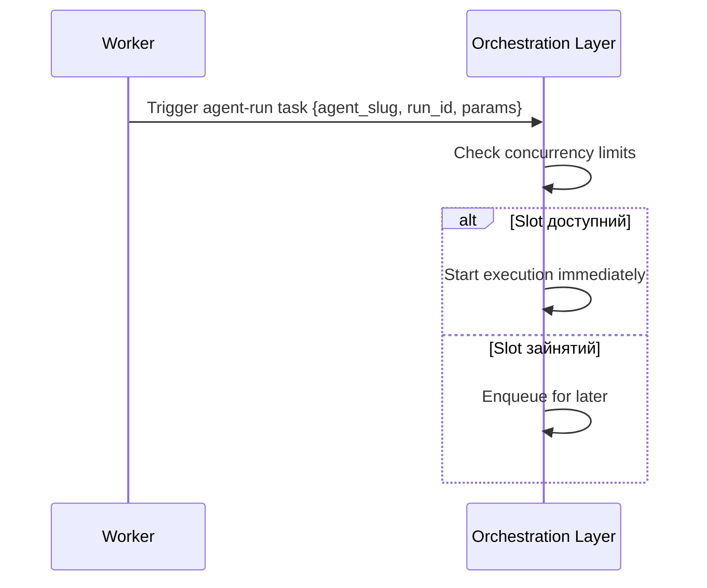
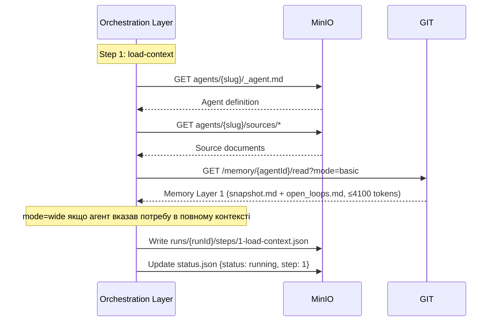
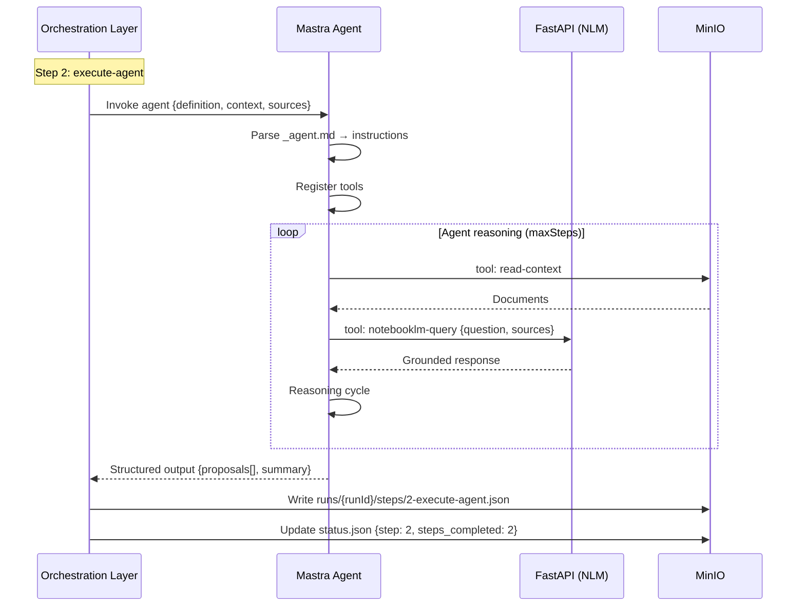
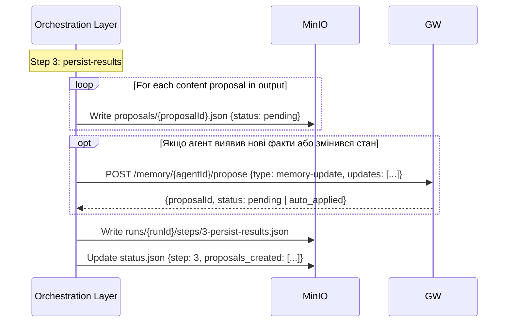
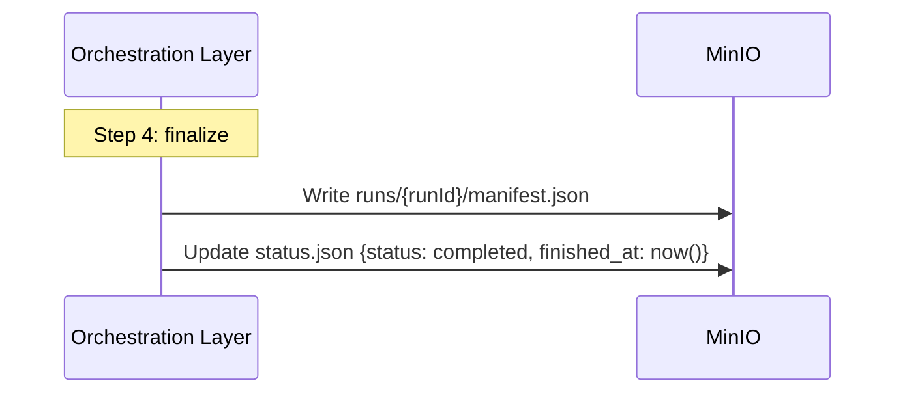
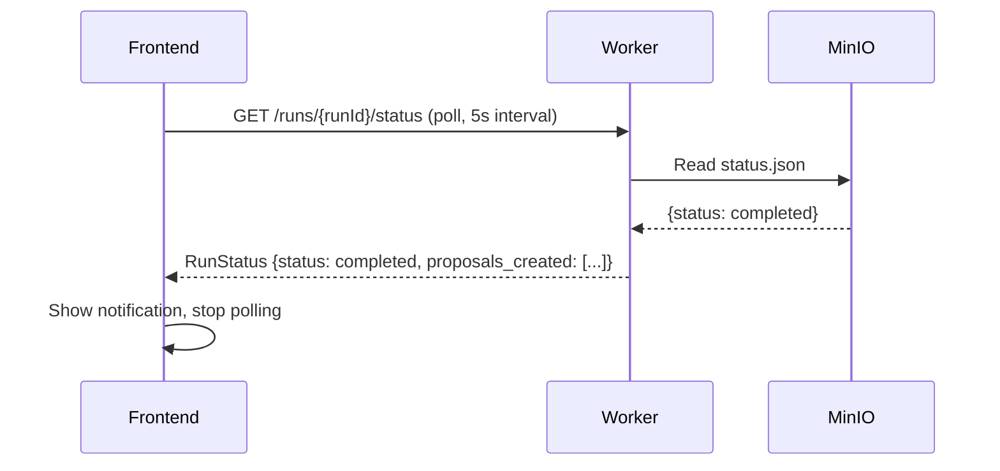

---
{"tags":["domain:execution","status:canonical","format:spec","feature:execution","feature:orchestration"],"created":"2026-02-21","updated":"2026-02-21","tier":1,"title":"КАНОНІЧНИЙ_КОНВЕЄР_ВИКОНАННЯ","dg-publish":true,"dg-metatags":null,"dg-home":null,"permalink":"/exodus.pp.ua/architecture/КАНОНІЧНИЙ_КОНВЕЄР_ВИКОНАННЯ/","dgPassFrontmatter":true,"noteIcon":""}
---

# Execution Pipeline: Канонічна специфікація

> Створено: 2026-02-15
> Автор: Головний архітектор системи
> Статус: Канонічна специфікація
> Мова: Українська (канонічна)
> Частина: ІНДЕКС_АРХІТЕКТУРИ_ВИКОНАННЯ.md

---

## 0. Призначення

Цей документ описує **execution pipeline** — послідовність кроків від ініціювання run до запису результату. Він визначає:

- Повний pipeline від trigger до terminal state
- Контракти між компонентами на кожному етапі
- Data flow: що передається між компонентами
- Ordering guarantees

**[ПРИНЦИП]** Pipeline описано у термінах компонентних ролей, не vendor API. Конкретна реалізація Orchestration Layer може відрізнятися, але послідовність та контракти — canonical.

---

## 1. Pipeline Overview

```
Owner → Frontend → Worker → Orchestration Layer → Mastra → MinIO
                                                        ↕
                                                     FastAPI (NLM)
```

### 1.1 Фази pipeline

| Фаза | Компонент | Вхід | Вихід |
|------|----------|------|-------|
| **1. Trigger** | Worker | HTTP request від frontend | Orchestration event/trigger |
| **2. Enqueue** | Orchestration Layer | Event/trigger | Queued task |
| **3. Load Context** | Orchestration Layer → MinIO + git monorepo | agent_slug | _agent.md + sources + memory (Layer 1) |
| **4. Execute Agent** | Orchestration Layer → Mastra | Context + instructions + memory | Structured output |
| **5. Persist Results** | Orchestration Layer → MinIO + Gateway | Proposal(и), step results, memory-update | MinIO objects + git commit |
| **6. Finalize** | Orchestration Layer → MinIO | Run summary | manifest.json + status.json=completed |
| **7. Notify** | Worker → Frontend | Status change | Poll response / SSE event |

---

## 2. Pipeline Detail

### 2.1 Phase 1: Trigger



**Контракт:**
- Worker **генерує** `run_id` (формат: `run_{date}_{time}_{random}`)
- Worker **записує** початковий `status.json` з `status: requested`
- Worker повертає **202 Accepted** (асинхронна операція)
- Frontend починає polling `GET /runs/{runId}/status`

### 2.2 Phase 2: Enqueue



**Контракт:**
- Worker передає trigger через Orchestration Layer Adapter
- Orchestration Layer перевіряє concurrency (max 1 per agent)
- Якщо slot зайнятий → run залишається в черзі, status → `queued`
- Orchestration Layer оновлює status.json у MinIO

### 2.3 Phase 3: Load Context



**Контракт:**
- Orchestration Layer wrapper виконує step та записує результат
- Кожен step має свій JSON у `steps/`
- Status.json оновлюється **після** успішного step write
- Memory Layer 1 завантажується через Gateway `/memory/:agentId/read` (git monorepo)
- Layer 2 (decisions, runs, timeline) — **не завантажується автоматично** (архітектурний інваріант)

### 2.4 Phase 4: Execute Agent



**Контракт:**
- Orchestration Layer передає context у Mastra
- Mastra виконує agent logic (LLM calls, tool use)
- Mastra повертає **structured output** — не пише у MinIO напряму
- Orchestration Layer wrapper записує результат step

**[ІНВАРІАНТ]** Mastra **не пише** `status.json`. Mastra повертає результат Orchestration Layer, який є canonical writer.

### 2.5 Phase 5: Persist Results



**Контракт:**
- Content proposals (propose-edit, propose-summary тощо) → MinIO зі статусом `pending`
- Memory-update proposals → Gateway (git monorepo); можуть бути auto-approved (normal priority)
- Logic-update proposals → Gateway; завжди `requiresHumanReview: true`, ніколи auto-approved
- Step result записується у MinIO

### 2.6 Phase 6: Finalize



**Контракт:**
- Manifest.json містить summary всього run
- Status.json → `completed` (terminal state)
- Після цього — жодних writes до run directory

### 2.7 Phase 7: Notify



**Контракт:**
- Frontend дізнається про завершення через polling
- Worker читає status.json з MinIO (canonical source)
- Frontend зупиняє polling при terminal state

---

## 3. Data Flow Summary

```
┌─────────────────────────────────────────────────────────────────┐
│                        Data Flow                                 │
│                                                                   │
│  Frontend ──HTTP──▶ Worker ──Trigger──▶ Orchestration Layer       │
│                       │                       │                   │
│                       │                       ▼                   │
│                       │               Mastra Agent                │
│                       │                  │    │                   │
│                       │          tools   │    │ tools             │
│                       │                  ▼    ▼                   │
│                       │               FastAPI  MinIO              │
│                       │                         ▲                 │
│                       │                         │                 │
│                       │    Orchestration Layer───┘                │
│                       │    writes status.json,                    │
│                       │    steps/, proposals/                     │
│                       │                         │                 │
│                       ▼                         │                 │
│  Frontend ◀──Poll──Worker ──Read────────────────┘                │
│                                                                   │
│  ═══════════════════════════════════════════════════════════════  │
│  Canonical data: MinIO                                           │
│  Ephemeral data: Orchestration Layer execution state              │
│  No data: Frontend, Worker (stateless proxies)                   │
└─────────────────────────────────────────────────────────────────┘
```

---

## 4. Ordering Guarantees

### 4.1 Step ordering

**[ІНВАРІАНТ]** Steps виконуються **послідовно** в межах одного run. Orchestration Layer гарантує:

1. Step N завершується **перед** початком Step N+1
2. Step result записується у MinIO **перед** початком наступного step
3. Status.json оновлюється **після** запису step result

### 4.2 Write ordering

**[ІНВАРІАНТ]** Для кожного step:

```
1. Mastra повертає результат
2. Step result → MinIO (steps/N.json)
3. Status.json оновлюється (steps_completed++)
```

Ця послідовність гарантує, що status.json завжди відображає фактично завершені steps.

### 4.3 Concurrency

**[ІНВАРІАНТ]** Один агент має максимум **один** concurrent run.

| Ситуація | Поведінка |
|---------|----------|
| Агент вже running | Новий run → queued |
| Глобальний ліміт досягнуто | Новий run → queued |
| Concurrency slot вільний | Run починається негайно |

---

## 5. Error Recovery

### 5.1 Component failure matrix

| Компонент | Failure | Recovery | Хто виконує |
|----------|---------|----------|------------|
| Mastra crash | Step fails | Orchestration Layer retries step | Orchestration Layer |
| NLM unavailable | Tool call fails | Mastra retries tool; then step fails | Mastra → Orchestration Layer |
| MinIO unavailable | Write fails | Orchestration Layer retries; then run fails | Orchestration Layer |
| Orchestration Layer restart | In-flight run interrupted | Durable execution replays from last checkpoint | Orchestration Layer (inherent) |
| Worker restart | API unavailable | Frontend retries poll | Frontend |

### 5.2 Idempotency

**[ІНВАРІАНТ]** Кожен step має бути **ідемпотентним** — повторне виконання не повинно створювати дублікати.

- Step result записується з фіксованим path: `steps/{step_number}-{step_name}.json`
- Proposal ID генерується детерміністично або з dedup check
- Status.json update ідемпотентний (same status = no-op)

---

## Див. також

- **КАНОНІЧНА_АРХІТЕКТУРА_ВИКОНАННЯ.md** — загальна canonical архітектура
- **АБСТРАКЦІЯ_РІВНЯ_ОРКЕСТРАЦІЇ.md** — абстракція Orchestration Layer
- **КАНОНІЧНИЙ_ЦИКЛ_ЗАПУСКУ.md** — lifecycle стани run
- **КАНОНІЧНА_МОДЕЛЬ_АВТОРИТЕТУ_СХОВИЩА.md** — storage authority
- **ІНДЕКС_АРХІТЕКТУРИ_ВИКОНАННЯ.md** — master index

---

## Семантичні зв'язки

**Цей документ деталізує:**
- [[exodus.pp.ua/architecture/АРХІТЕКТУРНИЙ_КОРІНЬ\|АРХІТЕКТУРНИЙ_КОРІНЬ]] — §5 Canonical Flow: цей документ є його повним розкриттям

**Цей документ залежить від:**
- [[exodus.pp.ua/architecture/АБСТРАКЦІЯ_РІВНЯ_ОРКЕСТРАЦІЇ\|АБСТРАКЦІЯ_РІВНЯ_ОРКЕСТРАЦІЇ]] — Hatchet виконує кроки pipeline
- [[exodus.pp.ua/architecture/КАНОНІЧНИЙ_ЦИКЛ_ЗАПУСКУ\|КАНОНІЧНИЙ_ЦИКЛ_ЗАПУСКУ]] — state transitions прив'язані до фаз pipeline
- [[exodus.pp.ua/architecture/КАНОНІЧНА_МОДЕЛЬ_АВТОРИТЕТУ_СХОВИЩА\|КАНОНІЧНА_МОДЕЛЬ_АВТОРИТЕТУ_СХОВИЩА]] — write authority на кожній фазі
- [[exodus.pp.ua/architecture/ПАМ_ЯТЬ_АГЕНТА_GIT_DIFFMEM_V1\|ПАМ_ЯТЬ_АГЕНТА_GIT_DIFFMEM_V1]] — Phase 3: завантаження memory Layer 1
- [[exodus.pp.ua/architecture/INBOX_ТА_PROPOSAL_АРХІТЕКТУРА\|INBOX_ТА_PROPOSAL_АРХІТЕКТУРА]] — Phase 5: Proposal lifecycle після run

**Від цього документа залежать:**
- [[exodus.pp.ua/architecture/КАНОНІЧНА_АРХІТЕКТУРА_ВИКОНАННЯ\|КАНОНІЧНА_АРХІТЕКТУРА_ВИКОНАННЯ]] — pipeline є серцевиною runtime архітектури
- [[exodus.pp.ua/architecture/КОНТРАКТ_АГЕНТА_V1\|КОНТРАКТ_АГЕНТА_V1]] — що Mastra отримує на вході кожного step

---

*Цей документ є канонічною специфікацією Execution Pipeline. Він vendor-agnostic за задумом.*
