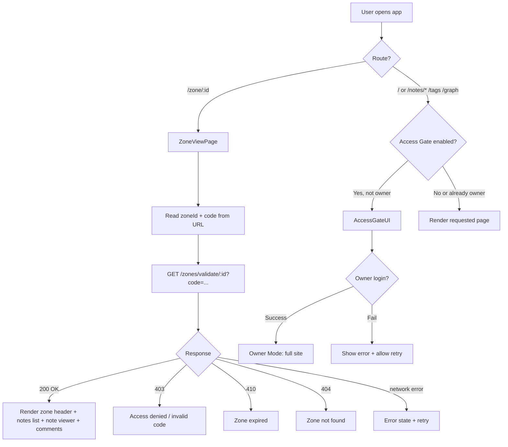
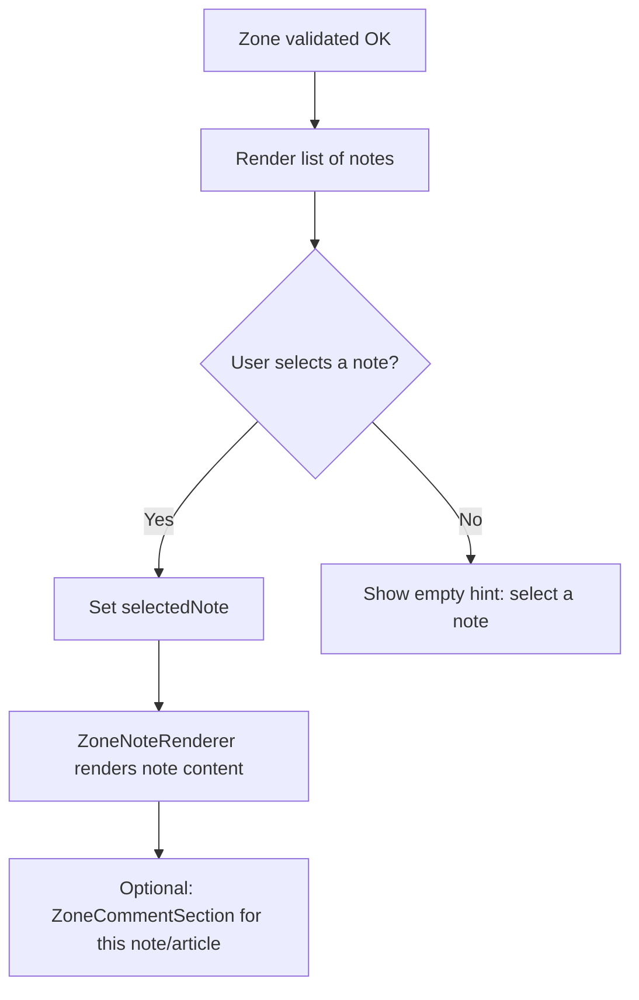

---
{"title":"Опис UX","dg-publish":true,"dg-metatags":null,"dg-home":null,"permalink":"/exodus.pp.ua/Опис UX/","dgPassFrontmatter":true,"noteIcon":""}
---


## 1) Що це за продукт і “що тут можна робити”

Це **Digital Garden / база знань** з markdown-нотаток, де контент читається як “wiki”: нотатки, теги, граф зв’язків, прев’ю зв’язків між думками. Є **режим власника (Owner Mode)** для керування доступами, і є **гостьовий режим** через “access zones” (делегований доступ за посиланням + кодом).

### Основні розділи (маршрути)

У роутінгу присутні:

- `/` — головна сторінка саду (огляд, свіжі нотатки, теги, “knowledge map” тощо)
- `/notes/:slug` — сторінка конкретної нотатки
- `/tags` та `/tags/:tag` — індекс тегів і сторінка тегу
- `/graph` — сторінка графа знань
- (у деяких фрагментах згадується ще `/files`)
- окремо: **гостьовий перегляд зони** `/zone/:id?code=...` (логіка є в проєкті як окрема сторінка ZoneViewPage)

### UX “читача” (звичайний користувач, без адмін-прав)

1. Відкриває головну (`/`) і бачить:
    
    - хедер/футер
    - ліву колонку: хмара тегів + “connected thoughts”
    - праву колонку: прев’ю карти знань + “Recent Notes” (5 останніх, з прев’ю тексту й лічильником зв’язків)
2. Переходить у нотатку:
    
    - читає контент
    - може переходити між внутрішніми посиланнями (wiki-стиль)
    - користується навігацією по тегах / графом (залежить від UI конкретної сторінки нотатки)
3. Працює з тегами (`/tags`, `/tags/:tag`) і графом (`/graph`) як з інструментами навігації по знаннях
    
4. Мовна локалізація:
    
    - інтерфейс підтримує кілька мов (uk/en/fr/de/it)
    - вибір мови зберігається у localStorage (`digital-garden-locale`)

---

## 2) Ролі та модель доступу (ключ до UX)

Система спроєктована як мінімум з двома “ролями”:

### A) Owner (власник/адмін)

- має повний доступ до сайту
- може керувати “зонами доступу” (Access Zones): створення, видалення, генерація URL, QR, (і потенційно MCP-URL)
- має автентифікацію через бекенд (Cloudflare Worker), що включає `/auth/status, /auth/setup, /auth/login, /auth/validate, /auth/logout`

### B) Guest / Delegated access (гість)

- не бачить повний сайт (в ідеалі — через **Access Gate**, який блокує публічний доступ)
- може читати лише контент, який дозволено конкретною зоною, за URL виду:
    - `/zone/:id?code=ACCESS-...`
- бекенд валідуює:
    - чи існує зона
    - чи співпадає `code`
    - чи не прострочена зона

---

## 3) UX гостьового доступу: ZoneViewPage (що бачить гість і як взаємодіє)

**ZoneViewPage** — це повноцінна сторінка “перегляду зони” з UX-станами: loading / invalid / expired / ok. Вона читає:

- `zoneId` з URL path
- `code` з query string (`?code=`)

### Основні UX-стани

1. **Loading**: повноекранний стан з loader і текстом `t.zoneView.loading`
    
2. **Invalid / error / access denied**:
    

- якщо нема `code` або код не співпав — очікувано “Invalid access code” / “Access denied” (залежить від реалізації `useZoneValidation` та відповіді воркера)

3. **Expired**:

- якщо `expiresAt` у минулому — показати “Expired” / “Zone expired”

4. **Valid**:

- показати назву/опис зони
- показати список нотаток у сайдбарі (ScrollArea)
- при кліку — відкривати нотатку в правій частині (рендер через `ZoneNoteRenderer`)

5. **Час до завершення**

- розрахунок прогресу “до експірації”
- є функція `getTimeRemaining()` з `useZoneValidation`
- прогрес-бар і колір (у коді є логіка “менше 1 години — destructive, <6 год — orange, інакше green”)

6. **Коментарі в зоні**

- на сторінці підключено `ZoneCommentSection` — отже гість (або гість/власник) може залишати коментарі в межах дозволеної зони
- бекенд-ендпоінти для коментарів/анотацій описані окремо: створення/отримання коментарів, створення/отримання анотацій, а для власника — модерація (PATCH/DELETE)

---

## 4) UX “власника”: що може робити Owner Mode

З документації структури компонентів видно, що Owner Mode має:

- OwnerSetupWizard — перше налаштування пароля
- OwnerLoginDialog — вхід власника
- OwnerModeIndicator — індикатор активного режиму
- OwnerSettingsDialog — налаштування (зокрема зміна пароля)
- AccessZonesManager / AccessZonesWall / ZoneCreationDialog / ZoneQRDialog — управління зонами

### Типовий UX сценарій власника

1. Відкриває сайт
2. Якщо власник ще не налаштований — проходить Setup Wizard (створює пароль)
3. Логіниться
4. Отримує доступ до:
    - повного контенту
    - створення зон доступу (вибір нотаток/папок, TTL, опис тощо — залежить від UI діалогів)
    - отримання “share link” для зони (Web URL + QR; потенційно MCP URL)

---

## 5) Access Gate (глобальна “брама” доступу)

В документації прямо зафіксовано вимогу: **публічний доступ до `/` та `/notes/*` має показувати Access Gate**, а не контент; при цьому `/zone/*` має обходити gate (але валідовуватись всередині).

> Важливий нюанс: у вас згадується, що `AccessGateUI.tsx` “форма входу за кодом (не інтегрована!)” — тобто UX задуманий, але інтеграція могла бути не завершена в момент формування файлів.

---

## 6) NotebookLM / “чат” по зонах (як частина UX)

У дереві компонентів присутні:

- `NotebookLMChatTab`, `NotebookLMChatPanel`, `NewNotebookLMChatDialog`
- стіни/списки: `NotebookLMZonesWall`, `NotebookLMChatsWall`
- `NotebookLMSetupPanel`, `NotebookLMStatusBadge` (у “zones”)

Це виглядає як UX-модуль, де:

- власник (або авторизований користувач) бачить список “NotebookLM зон”
- може створити/відкрити чат-сесію, і отримує панель діалогу (ChatPanel)
- може бачити статус інтеграції/готовності (StatusBadge/SetupPanel)

(Детальну поведінку цих екранів можна описати ще точніше, якщо ви дасте повний вміст цих компонентів — але навіть без цього видно IA-модель та наміри UI.)

---

## 7) Блок-схеми (Mermaid)

### 7.1 Глобальна навігація + доступ



### 7.2 ZoneViewPage: взаємодія з нотатками



### 7.3 Коментарі / анотації (спрощено)

```mermaid
flowchart TD
  U[User in zone] --> S[Open note/article]
  S --> C[CommentSection loads]
  C --> C1[GET /comments/:articleSlug with accessCode]
  U --> N[Write comment]
  N --> N1[POST /comments/create with accessCode]
  N1 --> N2[Show success (pending)]
  U --> H[Select text (optional)]
  H --> H1[AnnotationPopup]
  H1 --> H2[POST /annotations/create with offsets + comment + accessCode]
```

---

## 8) Псевдокод ключової користувацької логіки

### 8.1 Валідація доступу до зони (frontend hook + UI)

```pseudo
function ZoneViewPage():
  zoneId = params.zoneId
  accessCode = query.get("code")

  state = useZoneValidation(zoneId, accessCode)
  selectedNote = null

  if state.isLoading:
    render LoadingScreen()

  else if state.error OR !state.isValid:
    render AccessDenied(error=state.error)

  else if state.isExpired:
    render ExpiredScreen(timeRemaining=state.getTimeRemaining())

  else:
    render ZoneLayout(
      header = zone.name + zone.description + expirationProgress,
      sidebarNotes = zone.notes,
      content = selectedNote ? renderNote(selectedNote) : renderSelectHint(),
      comments = ZoneCommentSection()
    )

onNoteClick(note):
  selectedNote = note
```

(Це відповідає фактичному патерну: `zoneId` + `code`, `useZoneValidation`, `selectedNote`, loading state, прогрес експірації.)

### 8.2 Бекенд-логіка `/zones/validate/:id` (Cloudflare Worker)

```pseudo
function handleZonesValidate(zoneId, request):
  providedCode = URL(request.url).searchParams.get("code")
  zoneData = KV.get("zone:" + zoneId)

  if !zoneData:
    return 404 "Zone not found"

  zone = JSON.parse(zoneData)

  if !providedCode OR providedCode != zone.accessCode:
    return 403 "Invalid access code"

  if zone.expiresAt < now():
    return 410 "Zone expired"

  return 200 {
    success: true,
    id, name, description,
    folders: zone.allowedPaths,
    noteCount, notes,
    expiresAt: toEpoch(zone.expiresAt),
    accessType
  }
```

(Це практично дослівно з вашого плану виправлення й опису контракту.)

### 8.3 Логіка “Access Gate” (концепт)

```pseudo
function AccessGuard(children):
  if currentRoute startsWith "/zone/":
    return children  // zone validates itself

  if ownerAuth.isAuthenticated:
    return children

  return AccessGateUI(
    onLogin = (password) => ownerAuth.login(password)
  )
```

(Це випливає з acceptance criteria: блокувати `/` і `/notes/*`, але пропускати `/zone/*`.)

---

## 9) UX-стандартизація станів (що важливо для “професійного” відчуття)

Оскільки проєкт уже має чіткі loading/error стани в ZoneViewPage, рекомендую узгодити це по всьому продукту:

**Базові системні стани для будь-яких даних/запитів**

- Loading: skeleton/loader + короткий текст
- Empty: “нема нотаток/нема тегів/нема сесій”
- Error: дружнє повідомлення + “Retry” + технічні деталі тільки в debug-панелі (у вас вже є блок “Last API errors (client)” у деяких сторінках)

---

## 10) Що мені не вистачило для 100% “вичитки коду”

З наданих витягів видно **структуру і ключові екрани**, і є повна логіка ZoneViewPage, але **не було повних текстів**:

- `AccessGuard.tsx`, `AccessGateUI.tsx`
- `useOwnerAuth.tsx`, `useAccessZones.ts`, `useZoneValidation.ts`
- UI для Zone CRUD (AccessZonesManager/Wall, ZoneCreationDialog, QR dialog)
- NotebookLM chat компоненти

Тому вище я описав UX **точно там, де код/контракт видно**, а в місцях без повного коду — **акцентував намір, IA і критерії** (які у вас теж формалізовані).

Якщо ви дасте ці файли (контентом), я:

- доповню UX-опис **до рівня “екран → блоки → мікровзаємодії → валідації форм → edge cases”**,
- зроблю **окремі блок-схеми** для: “Owner setup/login/logout”, “Create zone”, “Share zone link/QR”, “NotebookLM chat create/use”, “Comments moderation”.

Хочете, щоб я оформив це як **один документ (PRD/UX spec)** зі змістом і нумерацією під команду (dev+QA)?